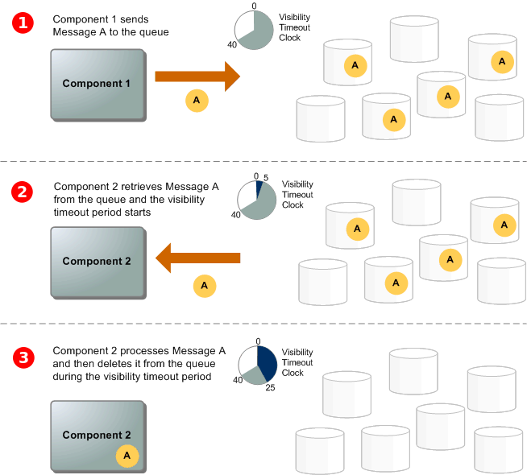
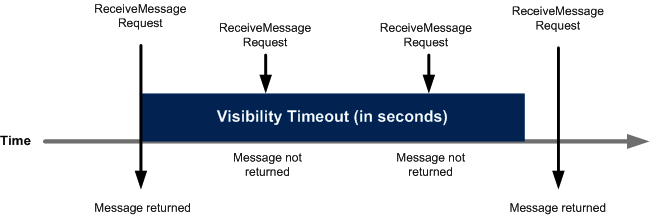

At first I was going to write about implementing a webhook architecture using Node.js,
AWS Lambda, AWS SQS, EC2 but during the writing I realized that I should first write about
SQS, so you and I both have a better understanding of how it works before we read about
some of the amazing things(webhooks) we can use it for.

## What is a Queue 🚶🏼‍🚶🏻‍🚶🏼‍🚶🏻‍

Let's suppose that you are a head of the passenger complaint department of a railway system.
You have only 1 person working in your team that listens to all of the passenger's complaints and file an
official complaint ticket on a paper and passes it to you for approval. Once approved, the complaint is processed
further.

Let's assume that your team member can file one complaint at a time but the number of passengers complaining
is more than 50. He will only be able to file only a few complaints and most of the passengers will leave in a bad
mood without filling a complaint because of all the chaos and crowd around the complaint corner.


Let's modify this system by introducing a queue concept in it. Let's say that now anyone can write their complaint on a
piece of paper and put it in a box which automatically _arranges_ all of the complaint papers in a _list_. Your team member
can now take one complaint ticket out of the box and process it. If the complaint information is insufficient,
it is ignored. There is no chaos, all of the passengers get to file complaints and each
complaint is seen by your team.

In the software world, you, the department head becomes the developer, railway system is your application and the guy listening to all
of the complaints becomes your server. If 100s of thousands of users try to request something from your server
your server will crash, so often times we need to introduce a queueing system so that each request gets stored in
a queue and our server takes each request out of that queue and process it at the rate that it can.

> This post is heavily inspired by AWS SQS Docs so that it becomes easy to skim through basic
> SQS concepts from one place rather than getting lost in the aws docs

## What is SQS 📬

This is the official definition of AWS SQS from [AWS Docs](https://docs.aws.amazon.com/AWSSimpleQueueService/latest/SQSDeveloperGuide/sqs-getting-started.html).

> Amazon Simple Queue Service (Amazon SQS) offers a secure, durable,
> and available hosted queue that lets you integrate and decouple
> distributed software systems and components

It is basically a highly durable queue that sits in the cloud. You can send/receive/delete
messages from this queue. At gerald we use SQS to manage async communication between our
microservices and also for our webhook architecture but you can use it temporary
store almost anything (logs, notifications, messages).

## How it Works ? 🛠

Your system/application can have components that could send messages to an SQS queue and receive messages
from the queue. The queue (which holds messages A through E) redundantly stores the messages across multiple Amazon SQS servers. So, although you have only one queue, Amazon stores multiple copies of your messages on multiple servers(all messages are a part of your queue).



## Message Lifecycle ✉️

- A _producer_ (component 1) sends message A to a queue, and the message is distributed across
  the Amazon SQS servers redundantly.
- When a _consumer_ (component 2) is ready to process messages, it consumes messages from the queue,
  and message A is returned. While message A is being processed, it remains in the queue
  and isn’t returned to subsequent receive requests for the duration
  of the _visibility timeout_ (explained below).
- The consumer (component 2) deletes message A from the queue to prevent the message from being
  received and processed again when the visibility timeout expires.

## Visibility Timeout 🔒

When a consumer receives and processes a message from a queue, the message remains in the queue.
Amazon SQS doesn’t automatically delete the message. Because Amazon SQS is a distributed system,
there’s no guarantee that the consumer actually receives the message (for example, due to a connectivity issue,
or due to an issue in the consumer application). Thus, the consumer _must delete_ the message from the queue after
receiving and processing it.



A message is considered to be _stored_ after it is sent to a queue by a producer, but not yet received
from the queue by a consumer (that is, between states 1 and 2). There is no limit to the number of
stored messages. A message is considered to be _in flight_ after it is received from a queue by a consumer,
but not yet deleted from the queue (that is, between states 2 and 3). There is a limit to the number of inflight messages.

> Amazon SQS automatically deletes messages that have been in a queue for more than maximum message
> retention period. The default message retention period is 4 days

## Standard Queues 📨

Standard queues are the default type of queues provided by AWS. They support at-least-once message delivery.
The other type is a FIFO queue which supports exactly once message delivery.

> However, occasionally (because of the highly distributed architecture that allows nearly unlimited throughput),
> more than one copy of a message might be delivered out of order.

Standard queues provide best-effort ordering which ensures that messages are generally
delivered in the same order as they’re sent.

## Queue Identifiers 📜

**Queue Name and URL**

When you create a new queue, you must specify a queue name unique for your AWS account
and region. Amazon SQS assigns each queue you create an identifier called a _queue URL_ that
includes the queue name and other Amazon SQS components. Whenever you want to perform an
action on a queue, you provide its queue URL.

**Message ID**

Each message receives a system-assigned _message ID_ that Amazon SQS returns to you in
the SendMessage response. This identifier is useful for identifying messages.

**Receipt Handle**

Every time you receive a message from a queue, you receive a _receipt handle_ for that
message. This handle is associated with the action of receiving the message, not with
the message itself. To delete the message or to change the message visibility, you must
provide the receipt handle (not the message ID). Thus, you must always receive a
message before you can delete it

## Message Attributes 🗝

Amazon SQS lets you include structured metadata (such as timestamps, geospatial data, signatures, and identifiers)
with messages using message attributes. Each message can have up to 10 attributes.
Message attributes are optional and separate from the message body (however, they are sent alongside it).
Your consumer can use message attributes to handle a message in a particular way without having to
process the message body first.

This is a sample Queue body.

```js
{
  "Records": [
    {
      "messageId": "19dd0b57-b21e-4ac1-bd88-01bbb068cb78",
      "receiptHandle": "MessageReceiptHandle",
      "body": {
        "foo": "bar"
      },
      "attributes": {
        "ApproximateReceiveCount": "1",
        "SentTimestamp": "1523232000000",
        "SenderId": "211312312",
        "ApproximateFirstReceiveTimestamp": "1523232000001"
      },
      "messageAttributes": {},
      "md5OfBody": "7b270e59b47ff90a553787216d55d91d",
      "eventSource": "aws:sqs",
      "eventSourceARN": "arn:aws:sqs:us-west-2:211312312:MyQueue",
      "awsRegion": "us-west-2"
    }
  ]
}
```

## Dead Letter Queues 📮

Sometimes, messages can’t be processed because of a variety of possible issues, such as
erroneous conditions within the producer or consumer application or an unexpected
state change that causes an issue with your application code. For example,
if a user places a web order with a particular product ID, but the product ID is deleted,
the web store’s code fails and displays an error, and the message with the order request is sent to a _dead-letter queue_.

## Thank you 🎈
