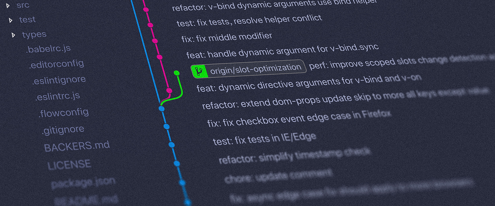
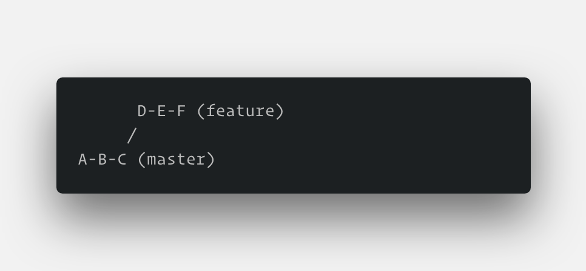
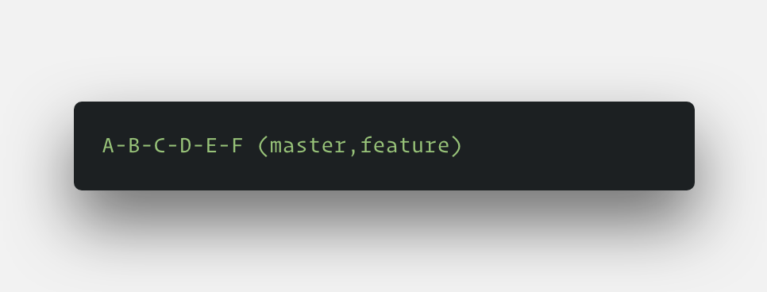
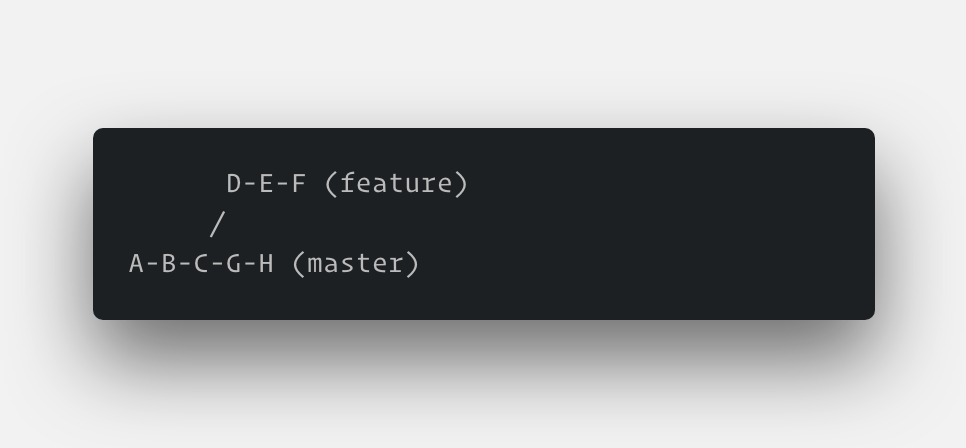
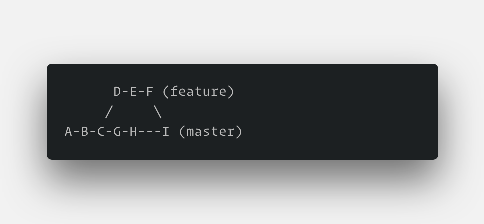
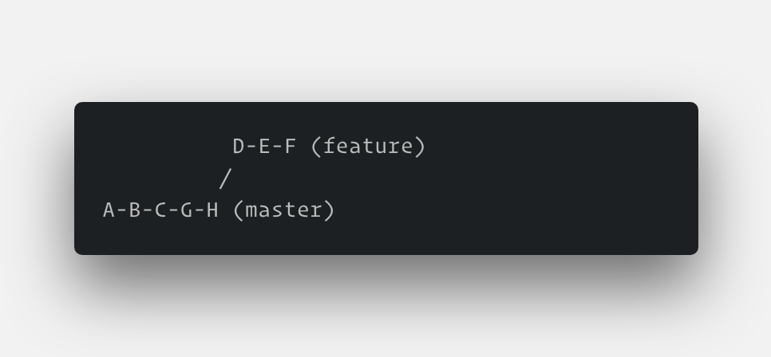
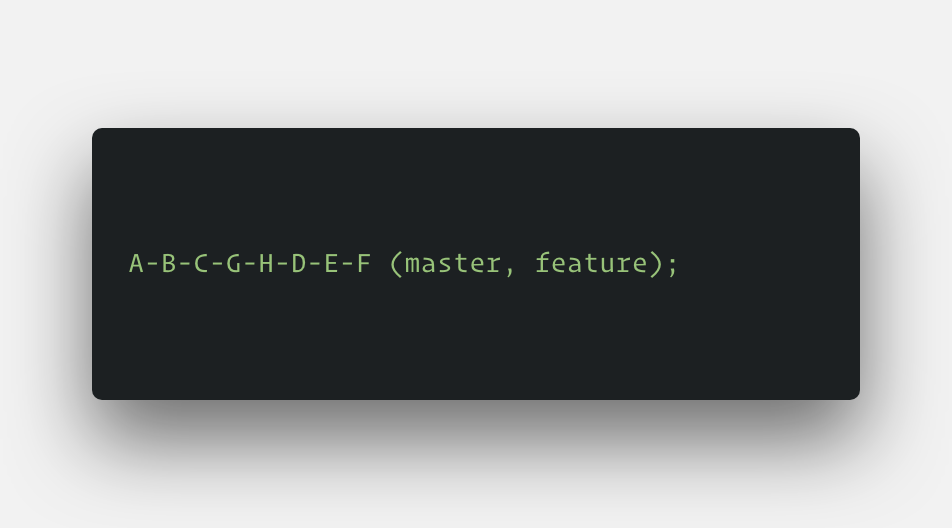

A `commit` in git is actually a unique hash of the current state of your staged files at that point in time.
You change or modify anything and commit again, git will generate a hash for that commit which will be different. The git history looks something similar to this. Each commit (hash) has some metadata attached to it like a name, date, who created the commit etc.

```shell
1313g6187296d763d1837h6hd173
1638716938h7163987c16h37hhh1
1827cbc7bhc23j23ch3h4727h498
hcw7b872hh6782368726h3874687
h781678326874h23846328746327
nc2382bc4278364c24c24798j272
```

> A branch in a GIT repository is nothing but a pointer to a commit. Similar to the **HEAD** pointer in git which points to a commit which is at the tip
> of that branch history.

```shell {1,3,4,5}
1313g6187296d763d1837h6hd173 <--- HEAD <--- master
1638716938h7163987c16h37hhh1
1827cbc7bhc23j23ch3h4727h498 <-- dev
hcw7b872hh6782368726h3874687 <-- feature/abc
h781678326874h23846328746327 <-- feature/magic
nc2382bc4278364c24c24798j272
```

When you checkout a branch you create another pointer pointing towards a particular commit.

Say we only have a `master` branch in our git repository. The git map would look something like what is shown
below.

```shell
1313g6187296d763d1837h6hd173 <--- HEAD <--- master
1638716938h7163987c16h37hhh1
1827cbc7bhc23j23ch3h4727h498
```

Now say we create another branch `dev` off of `master`. Then the git map would become like this. Notice that all branches
are pointing to the same commit.

```shell {1}
1313g6187296d763d1837h6hd173 <--- HEAD <--- master <--- dev
1638716938h7163987c16h37hhh1
1827cbc7bhc23j23ch3h4727h498
```

If we do some work in `dev` and commit it git creates a new hash (commit) in our git history
and the branch pointer starts pointing to the new commit. We can also see that `dev` is now ahead of `master`

```shell {1}
89889h8j2984j9827j49824j2344 <--- dev <--- HEAD
1313g6187296d763d1837h6hd173 <--- master
1638716938h7163987c16h37hhh1
1827cbc7bhc23j23ch3h4727h498
```

## Git Merge



In the diagram above when you checkout the master branch and merge feature onto master. Git will perform a fast forward
merge which means the pointer of the master will simply move to the tip of the feature branch.



But when there is already some work done (e.g G and H) on the master branch like this



Then git performs a 3 way merge with a merge commit (e.g I).



This creates a dirty history which is not very pleasant to the eyes.

## Git Rebase

The meaning behind the word "rebase" here is that it "rebase" some commits from your current branch and place them after the tip of the branch from which you want all the changes. That is why you "rebase" your current branch onto some other branch.
Rebasing re-writes the project history by creating brand new commits for each commit in the original branch.


Suppose this our git graph. Now before merging feature onto master we must make sure our feature branch is up-to-date with the work in the master branch because in this case, it isn't. There is extra work (G,H) in the master which is not in our feature branch. No instead of creating a **ugly merge commit** we can **pretend as if if checkout the master branch just right now with all the latest changes and did our feature work on it** That is what a rebase would do.

```shell
git checkout feature

git rebase master
```



Now our feature branch is up to date with the latest changes from master. As one would imagine it does play a lot with git history as it moves a lot of things around.

If we checkout the master branch now and merge the feature branch on top of it. It would perform a fast-forward merge.

```shell
git checkout master

git merge feature
```



This results in a cleaner history. This is why it is advised to rebase your feature branch on master before sending a PR.

> The golden rule of git rebase is **Never use it on a public branch** or after when you've submitted a PR.

## Interactive Rebasing

Interactive rebasing is basically git asking you **These are all the commits that I am about to rebase, do you want to modify something in this operation?** and sometimes we do want to modify some part of it.
When we commit too often our git history is filled with commits like `missing semicolon`, `missing formating`, `remove console.log from index` and we don't want these commits to be there, we sure want to keep the changes that these commits bring but we would like to hide/remove the commit message from history and **Interactive rebasing** is a great place to do just that and a lot of other things.

```shell
git checkout feature

git rebase -i master
```

This will open a text editor with content

```shell
pick 33d5b7a feature complete #1
pick 9480b3d missing semicolon #2
pick 5c67e61 removed console.log from index #3
```

By changing the pick command and/or re-ordering the entries, you can make the branch’s history look like whatever you want. For example, if the 2nd commit fixes a small problem in the 1st commit, you can condense them into a single commit with the fixup command:

```shell
pick 33d5b7a feature complete #1
fixup 9480b3d missing semicolon #2
fixup 5c67e61 removed console.log from index #3
```

When you save and close the file, Git will perform the rebase according to your instructions.

When calling git rebase, you have two options for the new base: The feature’s parent branch (e.g., master), or an earlier commit in your feature.
We saw an example of the first option in the Interactive Rebasing section.
The latter option is nice when you only need to fix up the last few commits. For example,
the following command begins an interactive rebase of only the last 3 commits.

```shell
git checkout feature

git rebase -i HEAD~3
```


> Use **git pull --rebase** to do a rebase instead of merging when pulling work from another branch

## Pull Request

If you use pull requests as part of your code review process, you need to avoid using git rebase after creating the pull request. As soon as you make the pull request, other developers will be looking at your commits,
which means that it’s a public branch. Re-writing its history will make it impossible for Git and your teammates to track any follow-up commits added to the feature.

Any changes from other developers need to be incorporated with git merge instead of git rebase.

For this reason, it’s usually a good idea to clean up your code with an interactive rebase before submitting your pull request.

## Approve the Feature and Merge in Master

You must not re-write commits in the master branch, you have to eventually use git merge to integrate the feature. However, by performing a rebase before the merge, you’re assured that the merge will be fast-forwarded,
resulting in a perfectly linear history. This also gives you the chance to squash any follow-up commits added during a pull request.

## Git Amend

Often times we create a commit and after that, we realize that we need to add a few more changes to that commit.

```shell
git add .

git commit --amend -m "new changes"
```

This command will push the new changes to the latest commit without creating a new commit.

> You can use **git amend** to modify the most recent commit message with `git commit --amend -m "New Message"`

## Git Blame

If we want to know who most recently modified some particular line in a file. We can use the git blame command.

`git blame <filename>`

and it will show a list of commits like this

```shell
a338528e (Tushar Sharma     2018-08-29 15:28:10 +0530   1) {
a338528e (Tushar Sharma     2018-08-29 15:28:10 +0530   2)   "name": "sample-app",
a338528e (Tushar Sharma     2018-08-29 15:28:10 +0530   3)   "version": "1.2.4",
a338528e (Tushar Sharma     2018-08-29 15:28:10 +0530   4)   "description": "Sample App",
a338528e (Tushar Sharma     2018-08-29 15:28:10 +0530   5)   "private": true,
a338528e (Tushar Sharma     2018-08-29 15:28:10 +0530   6)   "engines": {
```

To see more infor about a commit you can then use its `id` to log it.

`git log a338528e -p`

## Restore/Reset Commit

`git reset HEAD~`

This command will remove the latest commit on your local branch but it will keep all the changes in the staging area.

To remove the changes also use the `--hard` flag with reset.

`git reset --hard <commitID>`

This command will wipe out all the commits up until the commit id provided and brings the **HEAD** to this commit id.

## Undo A Commit

`git revert <commitId>`

This command will undo all the changes stored in the provided commit id and make a new commit of those changes.
So if you added 4 new lines in your file in a commit and you rever that commit. Git will remove those 4 lines in a new commit.
That way you can safely push to remote without the `--force` flag.
