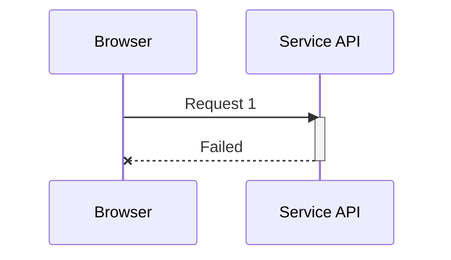
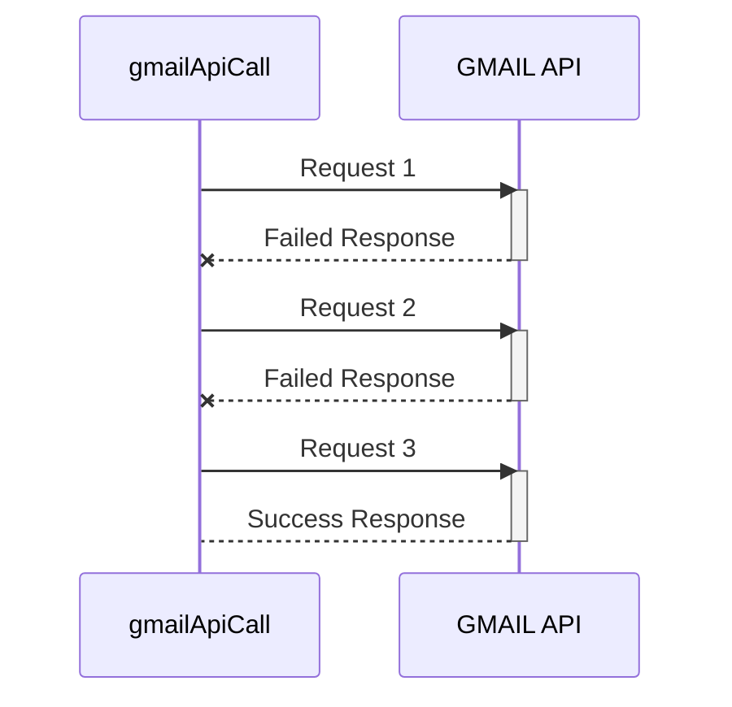

For the past 2 years, I've worked extensively with B2B services which include both using and for the most part
building B2B services using/connecting multiple 3rd party APIs. This blog post is about a design pattern which I recently had to implement for such a service.



A major difference between calling a HTTP endpoint from a UI and from a backend is that when we call a HTTP endpoint
from a UI (browser, mobile device, apple watch) and it fails we can notify the user that the action (calling API) was
unsuccessful and the user can try that again.

That's not the case when something wrong happens in the backend. At least not all the time. Often times we have to implement
cron jobs, multi-step workflows, data aggregation pipelines which can include multiple API calls in a single operation and
if any of the call fails then depending upon the implementation the whole operation could fail which is a waste of time
and resources. Let's see an example that will give some clarity.

```javascript {4,5,6,7,8,9}
async function aggregateData() {
  try {
    // executing the promises concurrently
    const facebook = http.get('https://api.facebook.com/v1/user/1234/');
    const linkedin = http.get('https://api.linkedin.com/v1/user/1234/');
    const instagram = http.get('https://api.instagram.com/v1/user/1234/');
    const twitter = http.get('https://api.twitter.com/v1/user/1234/');
    const reddit = http.get('https://api.reddit.com/v1/user/1234/');
    const gmail = http.get('https://api.gmail.com/v1/user/1234/');
    // waiting for all of them to settle
    await facebook;
    await linkedin;
    await instagram;
    await twitter;
    await reddit;
    await gmail;
    // this will be resolved immediately as our promises at this point are already
    // resolved
    const results = await Promise.all([
      facebook,
      instagram,
      twitter,
      linkedin,
      reddit,
      gmail
    ]);
    return transform(results);
  } catch (e) {
    throw e;
  }
}

aggregateData();
```

This `aggregateData` looks like it's doing a lot as it interacts with 2 different 3rd party APIs. Now suppose we get a
successful response from Facebook, LinkedIn, Instagram, Twitter, and Reddit but the call to Gmail fails for some
reason. The function would quit by throwing an error and we would have to run the function again to get the desired results.

Now imagine each call to an API has a fixed price. Say **\$0.005**. In our case we were calling around 20
different services in one single operation for aggregating the results. Failing of just one and with that
re-running the whole thing again was much more expensive than somehow retrying a each call at least a
few times on a failure.

> The `aggregateData` function is actually a very light function because it actually does no heavy synchronous
> computation. It only calls a bunch of APIs **asynchronously** and this is where **Node.js** shines. Thanks to the **Reactor Pattern**
> which is all over at the core of it.

So now, I decided to write a higher-order function which would wrap my API calls. It would atleast call that
API **n** times until it gets a succesfull response.

## Auto Retry API Call

This magic function could be implemented using **JS closures** but I decided to use **JS Promises**. Reason ? clean
and easy to follow implementation.

> Remember that **"Simple is Beautiful"**

Before we see the implementation we must know two important characteristics of `promises` and `async` functions that
would play a major role.

1. `async` functions always return promises.
2. You can return a resolved value from a **catch block** (in an `async` function) or a **promise.catch** (in a promise
   callback chain).

```javascript {2,15,30}
async function callMe() {
  return 2; // this is implicitly converted to a promise behind the scenes and then returned
}

callMe().then(val => console.log(val));

// OUTPUT
// 2

// Resolving a promise from a catch block
async function callMeAgain() {
  try {
    throw new Error();
  } catch {
    // error from the above try block will be caught here
    return 22; // and we return an implicit promise value instead of throwing an error or rejecting
  }
}

callMe().then(val => console.log(val));

// OUTPUT
// 22

async function rejectMe() {
  try {
    throw new Error();
  } catch (e) {
    // error from the above try block will be caught here
    return Promise.reject(e); // we could also do throw e to return a rejected promise from this async function
  }
}
```

By making use of the above two characteristics of promises and the good old recursion. We could implement a function that
would call itself **n** number of times before it quits.

```javascript
/**
 * @param promise A promise to resolve
 * @nthTry Number of tries before rejecting
 * @desc Retries a promise n no. of times before rejecting.
 * @returns resolved promise
 */
async function retryPromise(promise, nthTry) {
  try {
    // try to resolve the promise
    const data = await promise;
    // if resolved simply return the result back to the caller
    return data;
  } catch (e) {
    // if the promise fails and we are down to 1 try we reject
    if (nthTry === 1) {
      return Promise.reject(e);
    }
    // if the promise fails and the current try is not equal to 1
    // we call this function again from itself but this time
    // we reduce the no. of tries by one
    // so that eventually we reach to "1 try left" where we know we have to stop and reject
    console.log('retrying', nthTry, 'time');
    // we return whatever is the result of calling the same function
    return retryPromise(promise, nthTry - 1);
  }
}
```

This is only possible because of the two characteristics that we saw above. We could even make it
better by allowing it to wait for some time before trying to resolve the promise again.

```javascript {22}
/**
 * Util function to return a promise which is resolved in provided milliseconds
 */
function waitFor(millSeconds) {
  return new Promise((resolve, reject) => {
    setTimeout(() => {
      resolve();
    }, millSeconds);
  });
}

async function retryPromiseWithDelay(promise, nthTry, delayTime) {
  try {
    const res = await promise;
    return res;
  } catch (e) {
    if (nthTry === 1) {
      return Promise.reject(e);
    }
    console.log('retrying', nthTry, 'time');
    // wait for delayTime amount of time before calling this method again
    await waitFor(delayTime);
    return retryPromiseWithDelay(promise, nthTry - 1, delayTime);
  }
}
```

Now with this utility function in our toolkit. We would re-write our `aggregateData` function.

```javascript
async function aggregateData() {
  try {
    const retry = 4;
    const wait = 2000;
    // executing the promises concurrently
    const facebook = retryPromiseWithDelay(
      http.get('https://api.facebook.com/v1/user/1234/'),
      retry,
      wait
    );
    const linkedin = retryPromiseWithDelay(
      http.get('https://api.linkedin.com/v1/user/1234/'),
      retry,
      wait
    );
    const instagram = retryPromiseWithDelay(
      http.get('https://api.instagram.com/v1/user/1234/'),
      retry,
      wait
    );
    const twitter = retryPromiseWithDelay(
      http.get('https://api.twitter.com/v1/user/1234/'),
      retry,
      wait
    );
    const reddit = retryPromiseWithDelay(
      http.get('https://api.reddit.com/v1/user/1234/'),
      retry,
      wait
    );
    const gmail = retryPromiseWithDelay(
      http.get('https://api.gmail.com/v1/user/1234/'),
      retry,
      wait
    );
    // waiting for all of them to settle
    await facebook;
    await linkedin;
    await instagram;
    await twitter;
    await reddit;
    await gmail;
    // this will be resolved immediately as our promises at this point are already
    // resolved
    const results = await Promise.all([
      facebook,
      instagram,
      twitter,
      linkedin,
      reddit,
      gmail
    ]);
    return transform(results);
  } catch (e) {
    throw e;
  }
}

aggregateData();
```

Now each call to a 3rd party API will behave in a way similar to what is shown in the diagram below.



Of course this is not the only way or the best way to solve this problem but it makes it a lot better. In our case,
it certainly did bring down the number of times the function was getting called on a failed response.

One thing that I also want to emphasize on is that we don't have to use `npm` packages for functionalities that we
can implement in our codebase without over-complicating stuff. `npm` packages come with an overhead of maintenance.
I can modify the `retryPromise` function however and whenever I want according to the change in needs. That would not be
the case if I was using some npm package.

Thank you for reading this article.
