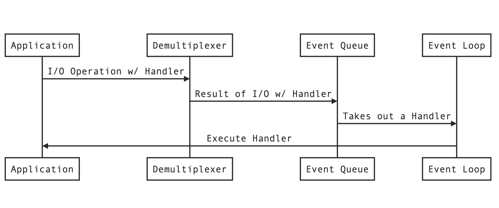

In traditional I/O blocking programming, each concurrent connection is handled by kicking off a new process or a thread in the CPU. So that even if a thread is blocked by some I/O operation. It doesn't block other connections(threads).

<p style="text-align:center;"></p>

Thread is expensive. The longer a thread lives, the longer the CPU has to perform context switching which wastes cpu time and memory.

## Non Blocking I/O

Most Operating Systems also support Non Blocking I/O. They return immediately without any data. But you can keep polling these resources for data once it is available.

```js
const resources = ['network', 'disk', 'database']

while(resources.length !=== 0) {
 // this loop will keep on running and thus polling unless all the resources are consumed or closed
 // CPU TIME WASTE
 for(let i=0; i<resources.length; i++) {
   const returnedValue = resources[i].poll();
   if(returnedValue === 'NO_DATA_AVAIL') {
     continue;
   } else if (returnedValue === 'SOURCE_CLOSED') {
     resources.splice(i, 1);
   } else {
     useData(returnedValue);
   }
 }
}
```

In this example, the `for loop` might run a lot of times even when the data isn't availble. Just runnning the loop like that would waste a lot of CPU Time. This is also called **Busy Waiting**.

## Event Demultiplexer

Also called **Event Notification Interface** is another way to react to events. In this mechanism the system collects and queues I/O events coming from a set of watched resources. It blocks the process until new events are available. So no CPU time is wasted waiting for events. This is also called the Event loop.

```javascript
const watchList = new Map();
watchList.set('network', 'READ');
watchList.set('disk', 'READ');
let events = [];

while ((events = demultiplexer.watch(watchList))) {
  // Event Loop will only run if there are events CPU TIME SAVE
  for (event of events) {
    let data = event.resource.read();
    // Not Checking for NO_DATA_AVAIL because demultiplexer
    // will only return an event when it has some data
    if (returnedValue === 'SOURCE_CLOSED') {
      demultiplexer.unwatch(event.resource);
    } else {
      useData(returnedValue);
    }
  }
}
```

## Reactor Pattern

To assign a hander(a callback) to each I/O operation in a system is called the Reactor Pattern. It's the responsibilty of th system to run the handler function once the data from the event is available.



In the above image

1. Application generates a new I/O task and pushes it to the Demultiplexer. The non-blocking call is immediately returned without any data.
2. While passing the task to the Demultiplexer a handler is assigned to the I/O task.
3. On its completion Demultiplexer pushes the results with the assigned handler to the Event Queue Data Structure.
4. Event Loop takes out one **Event Result** at a time from the Event Queue and pushes it to the application by executing the assigned handler(callback) with the result.
5. When there are no more events in the Event Queue and the Event Demultiplexer the Event Loop quits i.e node quits.

Each Operating System has a different interface for Event Demultiplexer and also even in the same OS different types of I/O behaves differently (File I/O in Unix is blocking in nature. So it needs a separate thread). All these inconsistecies across various platforms is handled by a library called **libuv**. **It exposes a common interface to interact with the Event Demultiplexer of major OS. It also implements the Reactor Pattern. It Manages the Event Queue, etc.**

<p style="text-align:center;"></p>

Using this pattern, Node.js can handle approx. 10,000 HTTP connections at the same time. Instead of creating a thread for each request, Node assigns a callback to each request. A Callback is way too cheaper when compared with a Thread.
