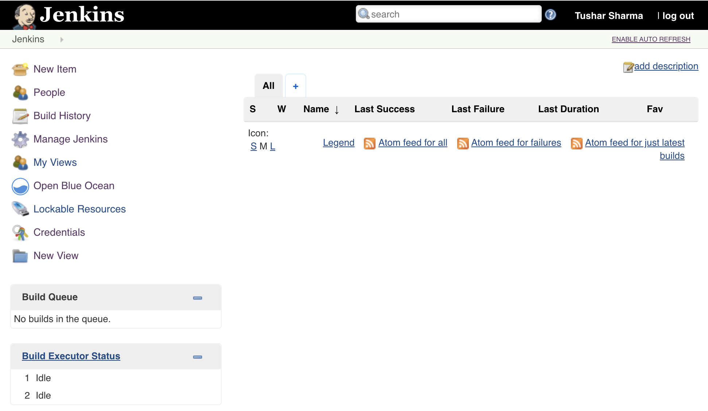
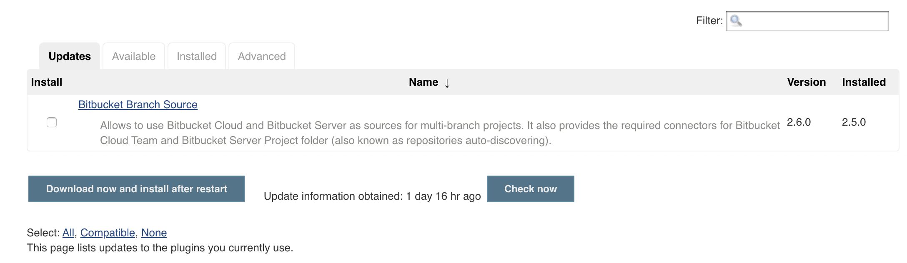
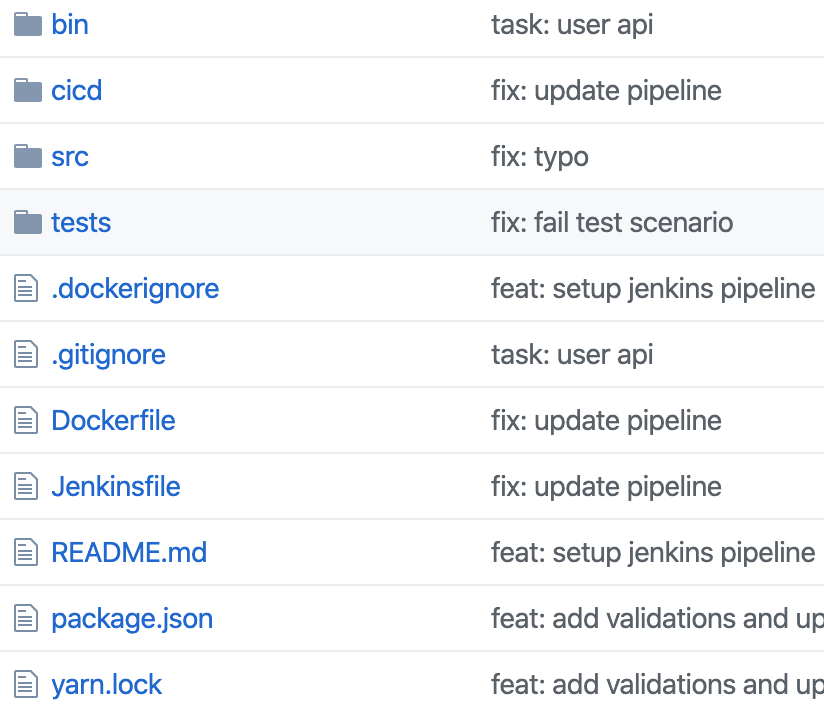
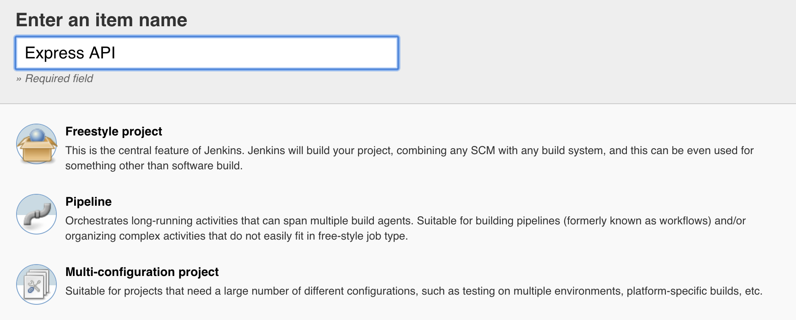
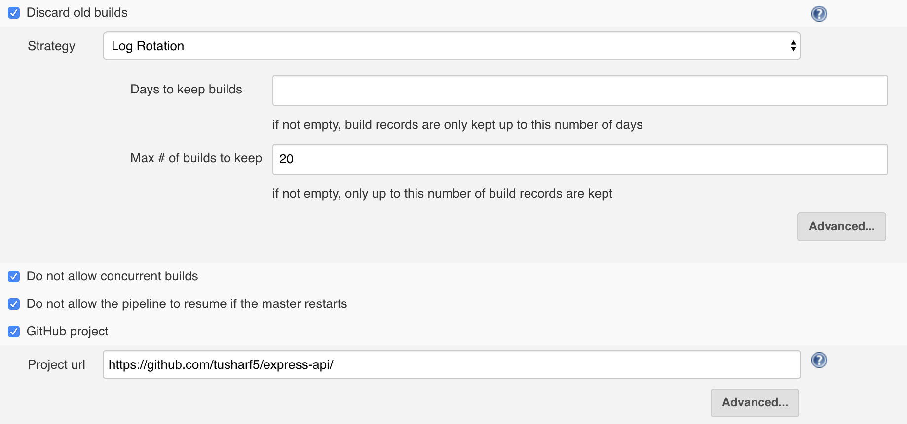
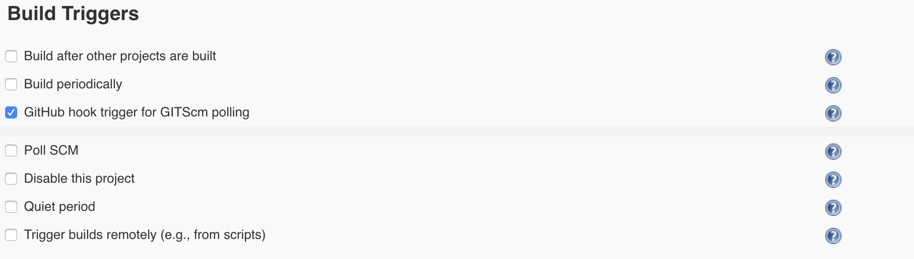
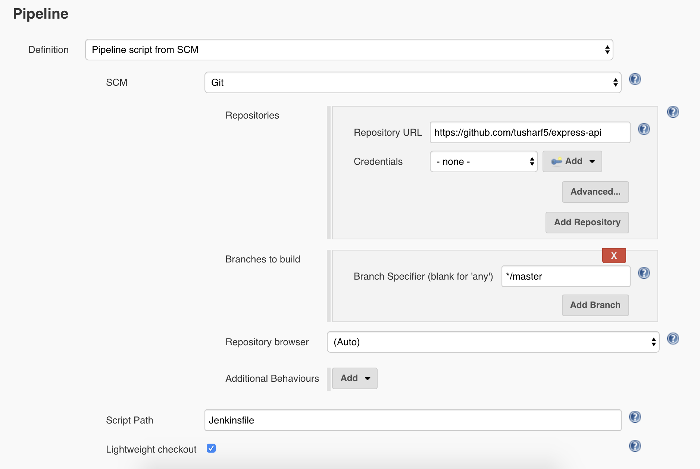
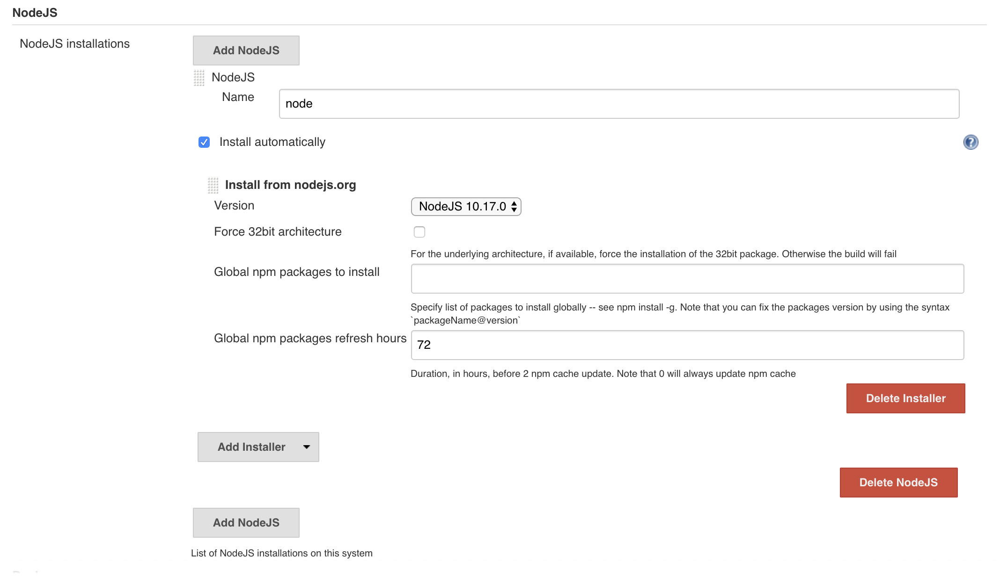
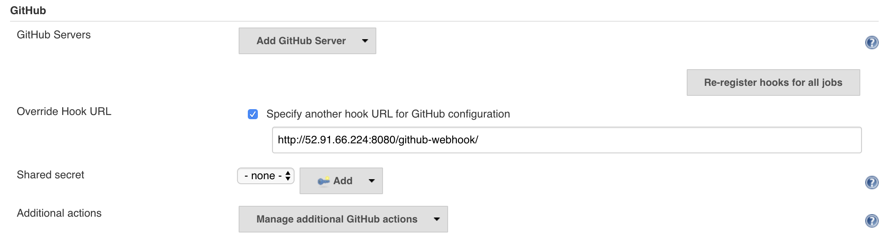
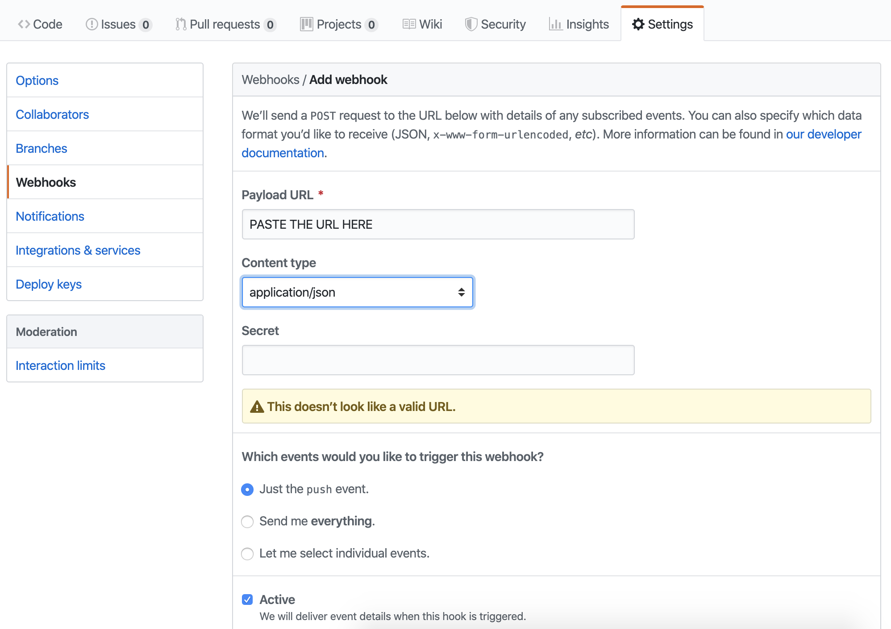

Having a CI/CD workflow in a project helps building features faster and with confidence. I've been there where I would push the changes to the master branch and then **login to the prod server**, **pull the latest code**, **update the environment**, **build**, and then **deploy the application**. There are so many things that could go wrong here and it's not even a one time thing, we build features weekly so this process is repeated every week. So for me, just the thought of not having to manualy perform these steps to deploy my applications lessens my anxiety.


I've used tools like Jenkins, Buddy Works, Travic CI to setup CI/CD pipelines at work and for side projects as well. My latest favourite is Buddy Works. It is a feature rich tool which offers both imperative and declarative ways to build your CI/CD pipelines.

In this blog though I'll talk about **Jenkins** which is a very popular and also the oldest _automation_ tool. It came out in 2005. We'll be using Jenkins to automate the testing and deployment of a node application on **AWS** **EC2** using **ECS (Elastic Container Service)**.

## Setting up Jenkins

We need a Jenkins server to setup the CI/CD pipeline. So let's do that first.

### Requirements

1. AWS account

### Steps

1. Launch a new EC2 instance which would host our Jenkins server.

   > Make sure you launch your EC2 instance in a public subnet and it has a public I.P address.

2. Open the 22(SSH) and 80(HTTP) ports on the security group that is attached to the instance.

3. SSH into your newly created EC2 instance.

4. Run the following commands after you have logged in.

```shell
# Update the server
sudo yum update –y
# Remove java 7
sudo yum remove java-1.7.0-openjdk
# Add jenkins repo
sudo wget -O /etc/yum.repos.d/jenkins.repo http://pkg.jenkins-ci.org/redhat/jenkins.repo
# Install docker
sudo amazon-linux-extras install -y docker
# Install java (1.8), jenkins, git, jQ (lib to work with json in shell)
sudo rpm — import http://pkg.jenkins-ci.org/redhat/jenkins-ci.org.key
sudo yum install -y java git jenkins jq
# add jenkins to the docker group
sudo usermod -a -G docker jenkins
# enable and start docker
sudo systemctl enable docker && systemctl start docker
# enable and start jenkins
sudo systemctl enable jenkins && systemctl start jenkins
```

Now you should have jenkins server running on "**http://<IP_ADDRESS_OF_EC2>:8080**" . Go to this address on your browser to continue your jenkins installation. When that is done you should see a page similar to this.



5. Go to **Manage Jenkins > Manage Plugins > Available**
   

6. Install these two plugins from here.

   > Click on restart Jenkins after downloading while installing these plugins.

   1. **Blue Ocean** (Makes Jenkins look cool)
   2. **Nodejs Plugin** (Helps Jenkins run node projects)

Now that we have our Jenkins server up and running. We need to setup a node.js project. We'll use GitHub to host our code in a public repository.

## Setting up a Node project

1. Create a new repository in Github.
2. You could use **express-generator** for a boilerplate api.



3. **src/app.js** contains the application code and **bin/www** has the code to create and run the server. To start the server we run **node ./bin/www**.

The repository is looking good. Now we need to create a new project on Jenkins which would have our CI/CD pipeline instructions for this repository.

## Creating New Project on Jenkins

1. Click on **New Item** on the left sidebar on the Jenkins home page.



2. Select **Pipeline** and click okay.
3. Select the **General** configuration for the pipeline.



4. This is important as this will tell Jenkins to trigger our pipeline on receiving a webhook from Github.



5. This section defines the actual pipeline (build, test, deploy, etc stages)
   We could either provide the definition as plain text in this section or either we could create a new file with the name **Jenkinsfile** at the rool level of our repository which would contain the instructions for our project.
6. Provide your repository details as shown in the image. You need to provide credentials too if your repository is private.



7. Now you can save your pipeline.

## Setup Auto Trigger New Build

1. Go to **Manage Jenkins** > **Global Tool Configuration**

   1. Find **NodeJs** section.
   2. Click on Add NodeJs
   3. Give a name "node v10" and select a node version
      Now we should be able to use this in our pipeline.

   

2. Go to **Manage Jenkins** > **Configure System**

   1. Find **Github** section.
   2. Click on **Advanced**.
   3. Check **Specify another hook URL for GitHub configuration**.
   4. Copy the Url.

   

3. Go to your Github repository.

   1. Go to **Settings > Webhooks**.
   2. Add a new webhook url which you just copied from the previous step.

   

4. Create a new file called **Jenkinsfile** at the root level of your repository with the following content.

```groovy
pipeline {
  agent any

  tools {nodejs "node v10"}

  stages {

    stage('Cloning Git') {
      steps {
        git 'https://github.com/tusharf5/express-api'
      }
    }

    stage('Test Run') {
      steps {
        sh 'npm ls'
      }
    }

  }
}
```

Congratulations 🎉!! At this point every new commit to your repository should trigger a new job in Jenkins.

## Push Latest Build on ECR

To deploy the latest code to your servers. You need to build a docke image with the latest code and upload that image to the ECR Docker Registry by AWS.

1. Go to **ECR** service page.
2. Click on **Create Repository**.
3. Give a repository name **myapp/api** and press button **Create repository**.
4. Now you should have your ECR repository created. You can see on overview page all needed informations like the Repository name and URI.

Now we need to make some changes to the Jenkins server so that Jenkins could connect to the ECR service and push latest built images to it. So first we'll create a new IAM user in AWS for our Jenkins server and then we'll setup the connection between the Jenkins and the ECR.

1. Create a new IAM user with just Programmatic Access having the following Permissions.
   1. **AmazonEC2ContainerRegistryPowerUser**
   2. **AmazonECS_FullAccess**
2. Copy the Access Key and Secret of the user.
3. SSH into your Jenkins server.
4. Type in the following commands.

```shell
# Switch to jenkins user
su -s /bin/bash jenkins

# configure AWS-CLI options
aws configure
...
AWS Access Key ID [None]: <AWS_JENKINS_USER_ACCESS_KEY>
AWS Secret Access Key [None]: <AWS_JENKINS_USER_ACCESS_SECRET>
Default region name [None]: <ECR_REGION>
Default output format [None]: json
...

# List repositories in registry (to test if it works)
aws ecr describe-repositories
```

5. Update your **Jenkinsfile** to have a build stage. We would also add some parameters which would be required by the build script to correctly build and push our docker images to AWS ECR.

```groovy
pipeline {
  agent any

  tools { nodejs "node v10" }

  parameters {
    string(name: 'REPONAME', defaultValue: 'myapp/api', description: 'AWS ECR Repository Name')
    string(name: 'ECR', defaultValue: '237724776192.dkr.ecr.us-east-1.amazonaws.com/myapp/api', description: 'AWS ECR Registry URI')
    string(name: 'REGION', defaultValue: 'us-east-1', description: 'AWS Region code')
    string(name: 'CLUSTER', defaultValue: 'ExampleCluster', description: 'AWS ECS Cluster name')
    string(name: 'TASK', defaultValue: 'ExampleTask', description: 'AWS ECS Task name')
  }

  stages {

    stage('Cloning Git') {
      steps {
        git 'https://github.com/tusharf5/express-api'
      }
    }

    stage('Test Run') {
      steps {
        sh 'npm ls'
      }
    }

    stage('Build Stage') {
      steps {
        sh "./cicd/build.sh -b ${env.BUILD_ID} -n ${params.REPONAME} -e ${params.ECR} -r ${params.REGION}"
      }
    }

  }
}
```

6. Create a new file **./cicd/build.sh** which would be the shell script to build and push our docker images to ECR. Give it executable permission.

```shell
#!/usr/bin/env bash

## shell options
set -e
set -u
set -f

## magic variables
declare REPONAME
declare ECR
declare REGION
declare BUILD_NUMBER
declare -r -i SUCCESS=0
declare -r -i NO_ARGS=85
declare -r -i BAD_ARGS=86
declare -r -i MISSING_ARGS=87

## script functions
function usage() {
  local FILE_NAME

  FILE_NAME=$(basename "$0")

  printf "Usage: %s [options...]\n" "$FILE_NAME"
  printf " -h\tprint help\n"
  printf " -n\tset ecr repository name\n"
  printf " -e\tset ecr repository uri\n"
  printf " -r\tset aws region\n"
  printf " -b\tset build number\n "
}

function no_args() {
  printf "Error: No arguments were passed\n"
  usage
  exit "$NO_ARGS"
}

function bad_args() {
  printf "Error: Wrong arguments supplied\n"
  usage
  exit "$BAD_ARGS"
}

function missing_args() {
  printf "Error: Missing argument for: %s\n" "$1"
  usage
  exit "$MISSING_ARGS"
}

## check script arguments
while getopts "hn:e:r:b:" OPTION; do
  case "$OPTION" in
    h) usage
       exit "$SUCCESS";;
    n) REPONAME="$OPTARG";;
    e) ECR="$OPTARG";;
    r) REGION="$OPTARG";;
    b) BUILD_NUMBER="$OPTARG";;
    *) bad_args;;
  esac
done

if [ "$OPTIND" -eq 1 ]; then
  no_args
fi

if [ -z "$REPONAME" ]; then
  missing_args '-n'
fi

if [ -z "$ECR" ]; then
  missing_args '-e'
fi

if [ -z "$REGION" ]; then
  missing_args '-r'
fi

if [ -z "$BUILD_NUMBER" ]; then
  missing_args '-b'
fi

## run main function
function main() {
  local LAST_ID
  # you can set this environment variable from Manage Jenkins since we don't want to commit
  local DB_URI=$DB_URI
  # delete all previous image(s)
  LAST_ID=$(docker images -q "$REPONAME")
  if [ -n "$LAST_ID" ]; then
    docker rmi -f "$LAST_ID"
  fi

  echo $DB_URI;

  # build new image and passing our DB_URI secret
  docker build --build-arg "DB_URI=$DB_URI" -t "$REPONAME:$BUILD_NUMBER" --pull=true .

  # tag image for AWS ECR
  docker tag "$REPONAME:$BUILD_NUMBER" "$ECR":"$BUILD_NUMBER"

  # basic auth into ECR
  $(aws ecr get-login --no-include-email --region "$REGION")

  # push image to AWS ECR
  docker push "$ECR":"$BUILD_NUMBER"
}

main

# exit
exit "$SUCCESS"
```

7. Create a **Dockerfile** at the root of your project.

```dockerfile
ARG DB_URI

FROM node:10
# We'll provide this from the Jenkins Env during build time
ARG DB_URI
ENV DB_URI ${DB_URI}
# Create app directory
WORKDIR /usr/src/app

# Install app dependencies
# A wildcard is used to ensure both package.json AND package-lock.json are copied
# where available (npm@5+)
COPY package*.json ./

RUN npm install
# If you are building your code for production
# RUN npm ci --only=production

# Bundle app source
COPY . .

EXPOSE 3000

CMD [ "node", "./bin/www" ]
```

At this point every new commit to your repository should trigger a new job which would build your docker image and pushes it to the ECR repository. You can check your ECR dashboard in AWS to see the images.

## Deploy Latest Build on ECS
