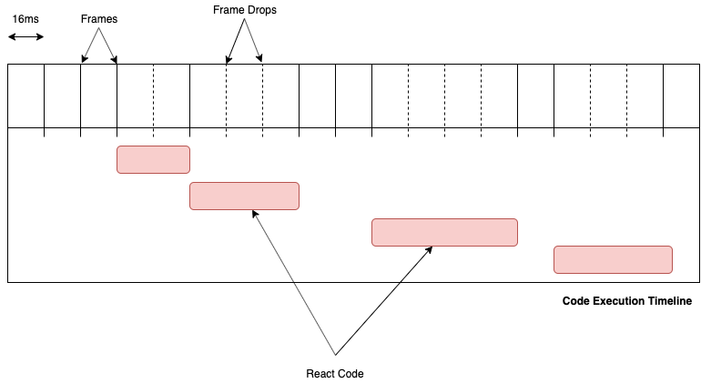

React is coming up with a lot of cool features lately. Features like **Hooks**, **Context**, **Suspense** and a few others that have significantly changed how we think about building new React components. A lot of these features were made possible because the core architecture of React was completely rewritten and props to the React team (no pun intended) the external API still remained the same i.e **NO BREAKING CHANGES!** 😲

This new architecture is called the **Fiber Arcitecture**. Many people think React Fiber will speed up a slow React app. While it works very efficiently, it doesn't aim to make React faster. We must realize that React still largely operates on the code that its users write. So even if the framework itself is very optimized and fast, if the application(userland) code is slow and unoptimized, the framework can't do much about it. If a framework only aims for speed, eventually it will hit a wall and would be considered slow when applications become large and complex.

This is similar to vertical scaling in terms of cloud computing. You can only do much with a single threaded language and that is why React Fiber aims to solve a more fundamental problem than speed and that is "**scheduling**". Fiber is better in terms of scheduling tasks. React Fiber is smart that means if the user code is unoptimized, it would try to run that unoptimized code in a way that it doesn't slow down or block the application. It handles concurrency way better than the previous implementation.

One of the React's selling point since it first came out has been the **virtual DOM**. The way it is implemented in React is using the concept of a **_reconciler_**. The React's reconciler is responsible for computing the difference between two state trees in React and only apply the differences to the DOM in a batch.

A React application is made up of components in a tree like structure. We often call it the component tree when debugging. Internally React also uses a similar tree like structure made up of nodes to represent an application. These nodes are connected to our components. So even if the components are updated or re-rendered these nodes stay the same to persist the component's state.


So when there is an update (`setState({...})`) React would start from the root node and update/build the tree while moving down the component tree i.e a complete traversal of your app's component tree.

## Stack Reconciler

React prior to version 15 was using a **Stack** like data structure for the tree traversal (using Recursion) and on every update the _reconciler_ builds a new copy of your component tree top to bottom, updating each component synchronously by calling the `render` method on it **AND** also updating the corresponding DOM nodes for that component in the same step before moving to the next node. So if the render method was slow then we might see a couple of frame drops in the UI as the browser will be busy executing the slow JS code and the UI would become unresponsive. Updating DOM at each step also leads to inconsistencies in your UI as React would apply changes to the DOM in parts during each step and not all at once.

For example, take the following component tree. Let's assume that the `Ads` component and the `RecommendedArticles` components do heavy computations and thus make the render slow.

```jsx
<section>
  <Ads />
  <RecommendedArticles />
  <Blog>
    <BlogHeader>
      <h1>Title</h1>
    </BlogHeader>
    <p>Description</p>
    <Link>
      <span>Read More</span>
    </Link>
  </Blog>
</section>
```

During an update caused by (e.g `setState`) React would start from the root node and build the node tree tree while moving down the component tree. For user defined components (`BlogHeader`, `Ads`, `Link`, etc) it would call the render method on them to get its children (It also calls the other lifecycle methods on these components). This is a synchronous and recursive process and React would only stop once the whole tree is finished. So Imagine if during this process someone clicked on the _Read More_ link on the page. Since the browser is busy executing the React code which is busy building the tree, so the browser won't be able to handle that click event and the UI would become unresponsive. The same thing would happen if the browser wants to re-paint the UI on a frame but the JS engine is busy, which would result in frame drops.



The UI, in this case, could appear janky and unresponsive at times if the application is fairly complex. Not just updates from React(which includes code from user base in render functions) would take time but updates from browser (timers, paints, api calls, etc) would be trapped behind these long taking synchronous updates.

## Fiber Reconciler

With the new fiber architecture, instead of using a Stack to do a recursive traversal React uses a new data structure called **Fiber**. It also makes use of while loops instead of recursion for performance reasons and another reason that I will discuss later in this post. In Fiber, React computes(updates/build) a part of our component tree, comes to check if there are any pending tasks (browser events, paints, timers, api calls, etc ) to do, if not then go back and continue computing the tree where it left off. See the image below.


So if React Stack takes **48ms** (approx. 3 frame drops) to do a task in one run. React Fiber would complete the same task in 3 runs of approx. **16ms** each thereby not dropping any frames. But how does React Fiber knows when to pause a task, how to pause a task and when to come back? Well, the answer lies in the Fiber architecture.

## React Fiber

The component tree is represented internally in React as a Fiber node. Each Fiber node is connected to your component using the `stateNode` field. The root node for the application is called `HostRoot` . Each fiber node has some fields through which it knows about its neighbours. The parent is connected to the immediate (and first in case of a list) child fiber node through the `child` field. All the direct children of a fiber node is connected to the parent via the `return` field. All of the immediate children fiber nodes has a pointer to the next child fiber node as `sibling`.

The `tag` field tells what type of fiber it is. Like is it a FunctionComponent, a ClassComponent, a Fragment, a ContextProvider, a HostComponent etc.

The `type` field corresponds to the Component type. For example, DOM elements are represented as string ('div', 'span', 'section', etc), Class component's type is the class itself, etc.

[This](https://github.com/acdlite/React-fiber-architecture#structure-of-a-fiber) is a great document by [Andrew Clark](https://github.com/acdlite) if you want to read more about the field structure of a Fiber node.

```json
{
  child,
  return,
  sibling,
  stateNode,
  ...
}
```

During the initial render, the React first generates your component tree which consists of fiber nodes. During the update process, React creates another tree called **workInProgress** tree. So the original tree is left untouched. This is not how the **Stack Reconciler** works. It mutates the actual tree as it updates it.

React Fiber updates our state tree in 2 major phases. When you call `setState` from a component React enqueues that state change in a queue called **updateQueue**. Each fiber node has an update queue which has of all the state changes for that node(component).

### Render/Reconciliation Phase

React builds the initial fiber node tree which is called the **current** fiber tree from the initial render.

In this phase (and for an update) fiber builds another fiber tree called **workInProgress** tree for the app. **This process can be interrupted** which means React can pause this work and do other work and later come back to it (as it makes use of while loops for this).

React execute this phase in **requestIdleCallback** i.e when the browser's main thread is idle. RequestIdleCallback returns the amount of time React can use to update/build the tree but after the time has elapsed browser will have some other things to process so React must pause whatever it's doing and return the control back to the browser.

React builds the **workInProgress** tree in a loop called **work loop** inside the **requestIdleCallback**. After every unit of work (processing a single fiber node), React marks where to start the **next unit of work** (i.e the next fiber node to process) and also checks how much time it has left before pausing. When it gets idle time from the **requestIdleCallback** it resumes that work loop.

To start creating the **workInProgress** tree, React starts to clone the current fiber tree node by node to the new tree. For each node that it copies it checks if there's any update callback in the **updateQueue** of that node. If yes then React executes all the callbacks in the **updateQueue** and computes the updated state of that component. If a node has changes that needs to be reflected in the DOM, React puts a special **tag** to the node.

The callbacks we provide to the `setState` call are actually stored in the **updateQueue** and it is during this time that React calls all of those callbacks to compute the updated state of that component.

```js
this.setState(state => {
  return { ...newState };
});
```

> Prefer using setState functions setState((state) => ({...})) which guarantees you the latest state passed in arguments as opposed to passing the new state as an object to setState. setState({...})

Once it has the updated props or state, it needs to know the children of that fiber node and to get the children it needs to call the **render** method of that component. Before calling the render method it calls **shouldComponentUpdate** to check if it should actually update the component or not. If there are no updates for a node then React would just reuse the node from the **current** tree without creating a new node. This process is repeated until it reaches a node without any children.

Once it has reached a node without any children. It would first update that node (if required) and then mark it as complete (meaning that all its children nodes are completed). React would then check if it has a sibling node and if yes it would process the sibling node and if it doesn't have a sibling onde React would go up to the parent node and mark the parent as **complete** also.

In this upward moving phase, React also builds the DOM relationships between the parent and the children DOM nodes. For e.g, if we have a `div` and a `section` above it. These two will have a relation in the fiber nodes but that relationship should also exist in the DOM. So it creates that relationship in the virtual DOM that it creates while building the **workInProgress** tree.

Now if a node has changes to be reflected in the DOM and it is marked as **complete**. It adds those changes to a list called **effect list** and pass that list to the parent node. This is also a recursive process. If the parent node also has some changes, it would merge them with the changes received from child nodes and when it is completed it would move those changes to its parent. At the end, the root node has access to the **effect list** with all of the changes in the node tree.

React sets this as a **pendingCommit**

### Commit Phase

In this phase fiber will apply the changes from the **pendingCommit** to the DOM. **This process cannot be interrupted (done all at once).** This process is also done in the requestIdleCallback and this is always the first thing React would do in that callback if there is a **pendingCommit**.

It synchronously goes through the changes in the effect list and applies them to the DOM. If we were using refs in our components, React would detach those refs and attach those again with the new DOM nodes.

The `HostRoot` node now starts pointing to the **workInProgress** tree which actually makes the workInProgress tree as the current tree (as it has the latest state of our application). The earlier **current** tree becomes the new **workInProgress** tree so React could reuse the nodes in it so it wont have to build the whole thing again.

This is called **double buffering** and this is the end of the update cycle.

That's it, the UI is updated, the state is updated.

So it's safe to say that the mental model for its working is still the same but the conceptual model or the implementation has changed.

Thanks for reading ⚛️
