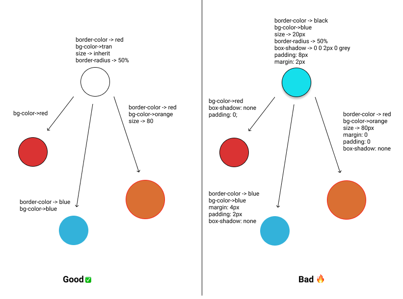
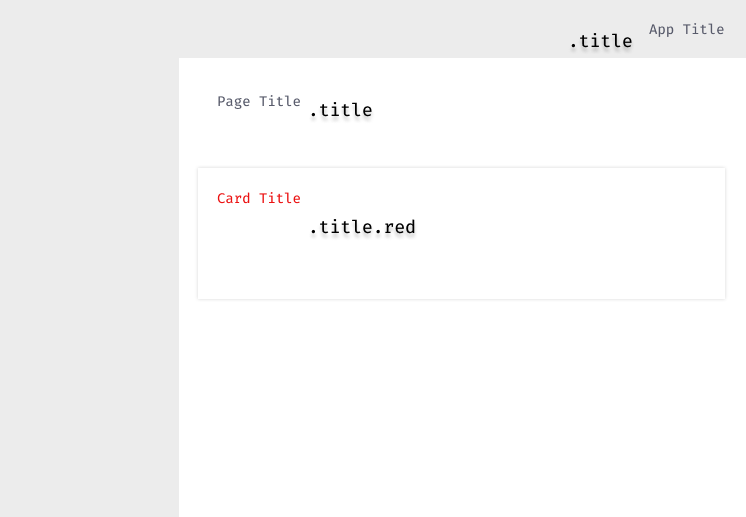

In a typical HTML project you would find multiple CSS files. One file could be for resetting the browser's default stylings, one for the globally applied CSS, page-specific CSS, component-specific CSS, behavior-specific CSS, context-specific CSS, and many more types.

Managing consistency in a project's UI especially when it scales requires work especially because the cascading nature of CSS makes it harder to maintain. I don't think anyone intentionally writes complex CSS. It is something that happens over time.

Let's take this `.primary` button CSS example. We only have two files `global.css` and `login.css`. It still has 4 different places where we are modifying the `.primary` class. These files are not even complete. Imagine a project with 100s of components and 15-30 pages. We could end up overwriting the `.primary` class so many times across the entire project.

```css
/** file global.css **/

.primary {
  color: blue;
  padding: 8px;
  line-height: 1.5;
  min-width: 80px;
  background-color: #fff;
  border-radiud: 4px;
  border: 1px solid blue;
  margin: 8px;
}
```

```css
/** file login.css **/

button.primary {
  box-shadow: none;
  appearance: none;
}

/** context is login form **/

.login-page .primary {
  background-color: blue;
  color: #fff;
  border: 1px solid #fff;
}

/** context is an alert dialog **/

.login-page .dialog .primary {
  background-color: #fff;
  color: blue;
  border: 1px solid blue;
  padding: 16px;
  margin: 16px 8px;
}
```

A **Design System** could help us to avoid polluting global CSS like that with overwrites but that is out of the scope of this post. So how can we minimize overwriting styles in a project?

The answer lies in the following two principals **good abstraction** and **reusability**.

See the image below. On the left side, we have a base circle with minimal stylings. To make different variants of this circle we only need to **add** a few new CSS properties. On the right side, we can see a base circle with all kinds of stylings on it. This is not reusable at all. We are almost **overwriting** every style of it when creating a new variant.



So when a developer who is new to a project (where CSS is written as shown in the **right diagram**) is building new components. It will be hard for him to even figure what classes he can **reuse** and where to find those classes.

As a result, he will end up writing his own **variant of the same class** somewhere which seems like a quick solution at first but when the project or the team scales out it really becomes a pain in the ass as all of a sudden everyone is coming up with their own version of components that look similar but the CSS behind those components is coming from different places in your project.

**Design Systems** are built to solve this problem bringing consistency in the UI, thus giving your brand a unique look.

So how do we make sure the CSS we write is easy to reuse and has good abstraction? I've discussed two of the many patterns that have helped us maintain CSS at scale while still keeping our sanity.

## More Cosmetics Less Positioning

For components that will or can be re-used in another place _write CSS that affects only the appearance and doesn't write CSS that affects the positioning of the element_.

`margin`, `padding`, `position`, `display`, `flex` are all examples of CSS that affects the positioning. Avoiding writing these in reusable components. These properties make it hard to reuse these classes without overwriting.

```css
// Good ✅

.primary {
  color: 'blue';
  background-color: 'white';
  font-weight: 400;
}

// Bad ❌

.primary {
  color: 'blue';
  padding: 4px 9px;
  background-color: 'white';
  font-weight: 400;
  margin: 4px;
  display: flex;
  position: 'relative';
}
```

#### Benefits

- It makes classes more reusable.
- It makes classes more extendable.
- It encourages developers to reuse classes which results in a consistent UI.

## Don't Overwrite Make Variants

Instead of overwriting CSS at different places make a new variant of the existing class by appending it with a new class.

```css
// Good ✅

.primary {
  color: 'blue';
  background-color: 'white';
  font-weight: 400;
}

// rounded variant

.primary.rounded {
  border-radius: 4px;
}

// disabled variant

.primary.disabled {
  background-color: #eaeaea;
  cursor: not-allowed;
}

// Bad ❌

// context specific variants ❌

.home nav > li > button.primary {
  border-radius: 4px;
}

.home nav > li > button.primary.disabled {
  background-color: #eaeaea;
  cursor: not-allowed;
}
```

#### Benefits

- All variants at one place. Easy to find.
- It makes the results of applying a class to an element more predictable.
- Encourages developers to reuse classes and variants which results in a consistent UI.
- Updating becomes a lot easier.

**So where do we write positioning CSS for reusable components?** A good place to write that is in the right context.

Let's say you have a **primary rounded button** on your navigation bar which requires a right margin of 12px and padding of 8px. We can say that this is context-specific positional CSS for the primary button inside the navigation bar.

```css
// navigation css file

.app-nav li button {
  padding: 8px;
  margin-right: 12px;
}
```

```html
<html>
  <body>
    <nav class="app-nav">
      <ul>
        <li>
          <button class="primary rounded">
            Login
          </button>
        </li>
      </ul>
    </nav>
  </body>
</html>
```

You can see the image below. A common `.title` class is used to give a text the appearance of a title throughout the application. But the positioning of the title text is different and thus requires varying CSS positioning properties.



A nice way to structure the above layout could be something like this.

```css
// global components and their variants file

.title {
  font: 'Fira Code',
  color: #585B6B;
  font-size: 1.05em;
}

.title.red {
  color: red;
}
```

Note that the above file only has **cosmetic** CSS and not positional. All the files below are context-specific CSS and do not overwrite the appearance of the `.title` class but only add context-specific positioning CSS.

```css
// navigation css file

.nav .title {
  margin-right: 8px;
  padding: 8px;
}
```

```css
// card css file

.card .title {
  margin-bottom: 8px;
}
```

```css
// page title file

.page .title {
  margin: 16px;
}
```

This brings us back to the title of this post **Composability** which means writing css that is easier to extend. By following the above two patterns we can ensure the CSS we write is **composable**.

Thanks for reading, you can go home now.
