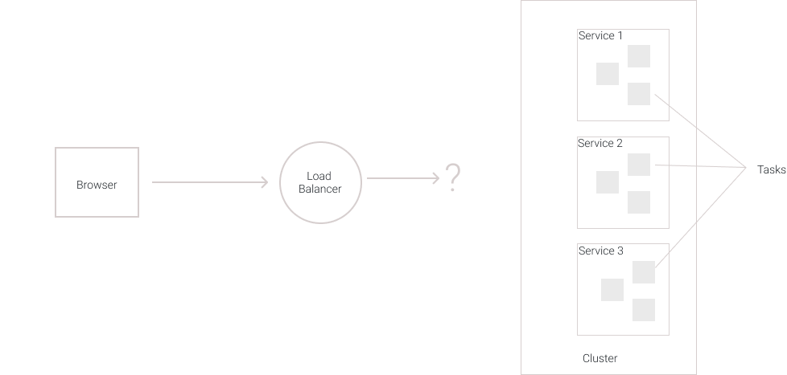
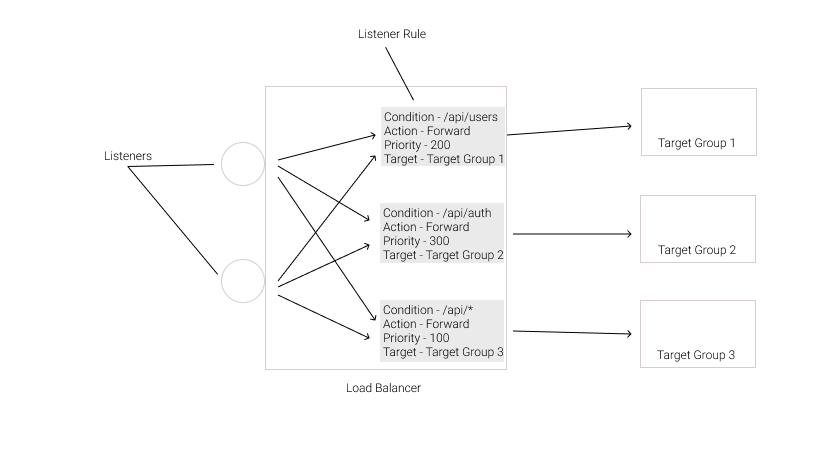
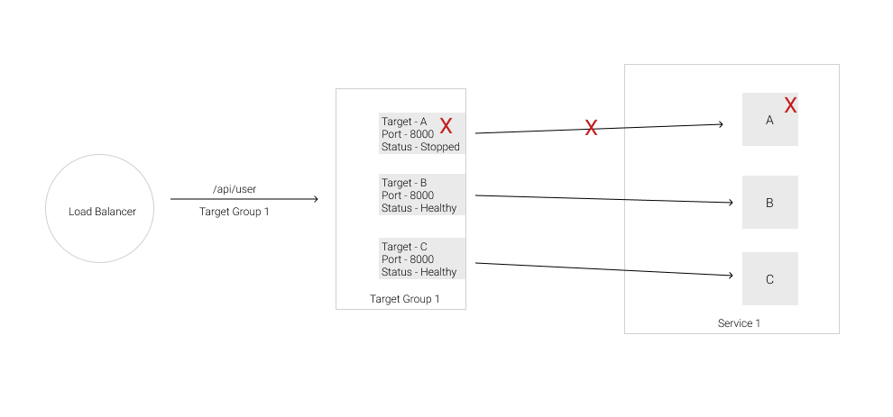
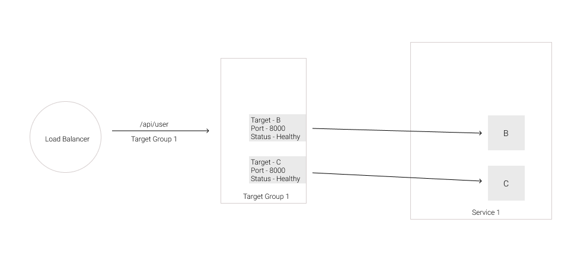
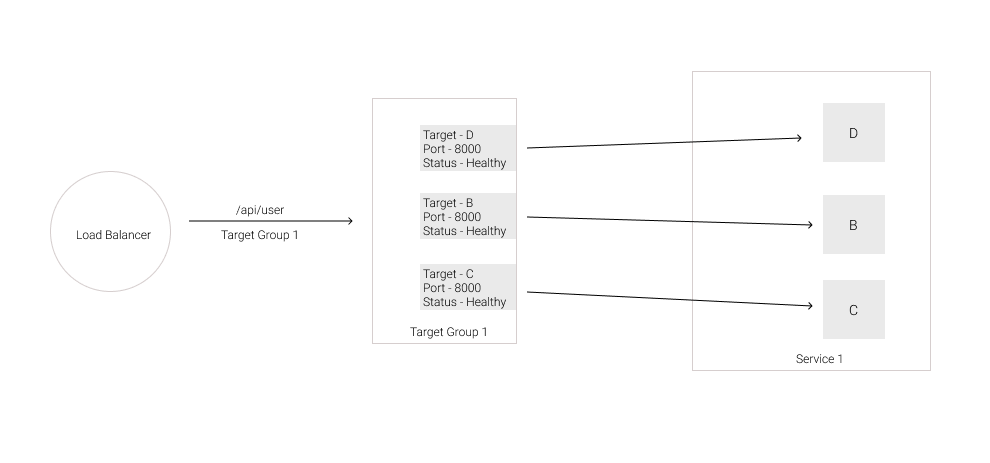

We recently migrated our cloud infrastructure from having one big monolith application server to having multiple different microservices. I think if I have to describe the whole experience it would be that "It's easy to talk about microservices and all the benefits you get from it but the switch is not that easy and if it seems easy, you're probably doing it the wrong way."

Choosing the right cloud framework for your application is the single most important decision in that path. **Dockerization** is the way to go for microservices and there are some big players in the market to manage your Docker containers like [Kubernetes](https://kubernetes.io/), [Google Cloud Engine](https://cloud.google.com/container-options), [AWS](https://aws.amazon.com/containers/), [Microsoft Azure](https://azure.microsoft.com/en-in/product-categories/containers/), etc. At Gerald, we decided to go with AWS as we were already using AWS and so we had a strong understanding of different concepts in the AWS world.

The purpose of this blog series is to lay out a path for designing a cloud-native application architecture using AWS ECS service which would cover a lot about different components of the service itself. I won't be going into too many details as the AWS documentation does a good job doing that.

So what do we need to have a cloud-native application running on AWS?

Well, the first thing we need is an application. Let's say that we have an **express API server**. We would also need a **Dockerfile** to dockerize our API server. Now let's discuss the ECS service and how it works.

I'll take the analogy of an orchestra when explaining different pars of ECS. In an Orchestra, they have a _conductor_ who leads all the other groups of musicians. In ECS that role is played by the **AWS ECS Service** itself (It's different from the **Service** component). The only caveat is that we have to provide instructions to the _conductor_ for him to manage different groups of musicians in the orchestra. That means the conductor doesn't know which song to play, when to start, when to finish, what group does what, we must provide that information to him.

Similarly, we have to provide a lot of instructions to the **ECS Service** about our container architecture for it to manage it for us.

## Cluster

So the first thing we tell our conductor is what stage is he performing on. So he can put musicians on that stage in different groups that they belong to. The stage is called the **Cluster**. You cannot perform without a stage, similarly, you cannot deploy containers without having a cluster.

A Cluster is a high-level **logical grouping** of your containers. For example, you can have a **database cluster** where you deploy your _database servers_, you can have an **API cluster** where you deploy your _API servers_ or a cluster for **background jobs**. You could also use just one cluster and have everything inside of that. You can group things at a lot of different levels in ECS. Cluster just comes at the top in that hierarchy.

## Service

Now in our Orchestra, we have different types of musicians, one who plays the violin, another plays the saxophone and another one is for the vocals. So we group similar types of musicians and call them as **Services**. So we would have a total of 3 services. The instructions, performance, and requirements for these 3 services are completely different but they still have to synchronize together for a good play.

A Service resides inside of a Cluster. It is yet another **logical grouping** of your containers but this grouping has a lot of attributes and features. We could imagine having a **Dashboard API Service**, **Authentication Service**, **User Service** inside of our **API Cluster**.

## Task

We still haven't defined a physical resource yet. Cluster is a logical grouping as well as a Service. But what about the musicians, what is their counterpart in ECS?

A musician performing with his instrument is an ECS **Task**.

A **Task** is a single **Container** running inside of a **Service**. This is the docker container we define a **Dockerfile** for in our project. A **Service** runs ideally should run only one type of task. It can run multiple copies of it though. That means a Task is an instance of our application code running inside of a docker container. So the hierarchy up until at this point is something like this.

One Cluster --> One or many different Services

One Service --> One or many copies of the same Task

## Docker Image

In our orchestra, we have to provide each musician with an instrument so they could play it. The instrument, in this case, is our **Docker Image**. For each Task, we have to provide a Docker Image and provide instructions on how to run that image. We provide the image as a URL of a Docker repository or AWS's docker repository called ECR.

## Task Definition

These instructions determine the characteristics and behavior of the Task that would run. These instructions are called Task Definitions. To create a Task you need a Task Definition. A lot of these instructions are options that you would pass to a `docker run` command when starting a container.

**Service** makes use of Task Definitions to create new Tasks. You need to provide the Task Definition when creating a Service.

## Load Balancer

At this point, we have a cluster and inside of that cluster, we have three services, inside of each service we have 3 tasks running. So now we are interested in making HTTP calls to these tasks. How do we do that?

The request would probably come from a browser through the internet and the way it reaches our tasks is through a Load Balancer (Application Load Balancer in our case).

## Target Group

Now you might be wondering how does one load balancer is aware of all the healthy and live Tasks running inside of different services. How does it know where to route which request. There must be a way we could define rules for that purpose. Each of these tasks could also shut down anytime (task failure) and new ones could be spinning up dynamically (auto-scaling). The answer to that lies in another ECS component called a **Target Group**.

Your Load Balancer could listen for incoming requests on multiple ports (generally it is 443 and 80). When a request comes on a listener port load balancer matches the request options with the configured Listener Rules. Each listener rule specifies a condition, target, action and a priority which determines how that rule should be matched with an incoming request and where to forward that request.

So if the LB gets a `/api/users` , it will quickly match it with the `Target Group 1` Listener Rule and forward that request to Target Group 1.

If the LB gets a `/api/auth` , it will quickly match it with the `Target Group 2` Listener Rule and forward that request to Target Group 2.

If the LB gets a `/api/items` , it will quickly match it with the `Target Group 3` Listener Rule because of the `*` in its Condition and forward that request to Target Group 3.

Ideally, you should have one **Target Group** per **Service**. A Target Group specifies how and where to reach the **Tasks** in a Service that it is attached with.

The diagram above is a zoomed-in view of the previous diagram on Target Group 1. In the diagram, Service 1 is running 3 tasks. A Service usually creates Tasks using the same Task Definition and that is why Tasks A, B and C are exact copies of each other. We have also created a Target Group for this Service named Target Group 1. The Target Group has all the information required to route the traffic from the Load balancer to the tasks running inside of this Service.

As you can see in the diagram we have registered 3 targets inside our Target Group 1. Each of these 3 targets is pointing to a Task inside of the Service. So when a request comes towards the Target Group. It will route it to any of the registered tasks in a balanced way (Round Robin).

What happens is when we first launch our ECS infrastructure ECS will take a look at the Service 1 configuration. It will note that we want to have at least 3 Tasks running at any point in time. The Target Group has no targets registered at this point.

ECS creates 3 Tasks using the Task Definition for that Service. ECS also registers the 3 Tasks it created in the Target Group as 3 different targets. Let's suppose that one of the tasks becomes unhealthy because of a server failure inside of that Task container. ECS takes down that Task and it also deregisters it from the Target Group.

So now we only have two Tasks running inside of our server and the Target Group also only has 2 targets registered.

ECS will quickly determine that in our service configuration we specified that at any given point we want 3 Tasks to be running. So ECS will spin up a new Task using the Task Definition for that Service. It will also register a target in the Target Group which will point to the newly created Task.

This is how ECS will make sure our application is available all the time even after a failure.

If you're still here I hope now you have a slightly better understanding of how ECS works which will make it easy to go through AWS Docs from here. There are still a lot of concepts left and I will cover them in the next part of this series which will include the following articles.

1. An Overview (this one)
2. AutoScaling
3. VPC
4. Service Discovery
5. CloudFormation
6. Your First Microservice

Thanks for reading.
