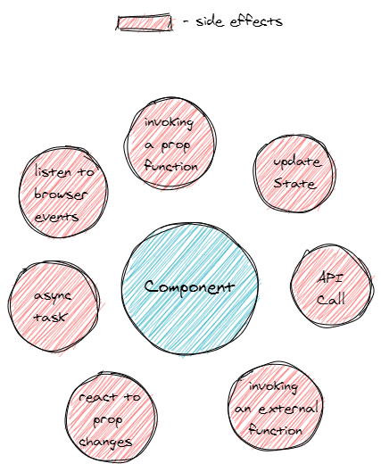
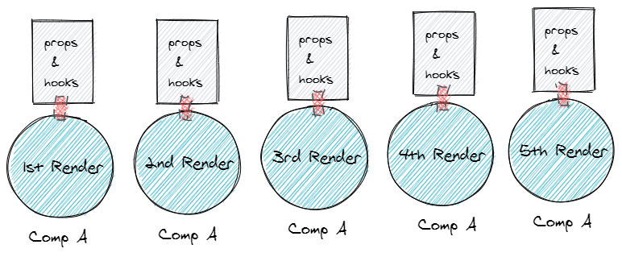
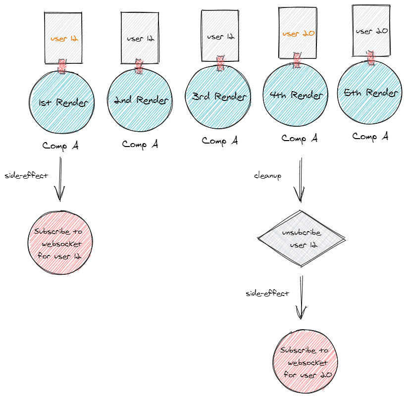

With the addition of [Hooks](https://reactjs.org/docs/hooks-intro.html) in React, developers could use a lot of react features that were only available through class components in function components also. React hooks don't directly bring anything new to react. It provides an API to use features like local state, component lifecycle, etc in function components. So why use hooks in function components if you can do pretty much everything using class components? Let's see.

**1. Less Code**

Class components require more boilerplate than function components. Take a look at this very simple class component.

```jsx
import React, { Component } from 'react';

export class BaseComponent extends Component {

  constructor(props) {
    super(props);
  }

  render() {
    return <div>Hello</div>;
  }
}
```

Compare it with the function component below which requires much less code.

```jsx
import React from 'react';

export function BaseComponent() {
  return <div>Hello</div>;
}
```

This is just one component, imagine having a large number of simple components like this. Not only will it increase the size of the code, but it is also not very productive having to write the boilerplate while creating simple components.

**2. Performance Boost**

A lot of people prefer to write function components as it gives (or will give) a performance boost. This was [recommended](https://reactjs.org/blog/2015/10/07/react-v0.14.html#stateless-functional-components) by the react team when they first introduced function components in react.

> This pattern (function components) is designed to encourage the creation of these simple components that should comprise large portions of your apps. In the future, we’ll also be able to make performance optimizations specific to these components by avoiding unnecessary checks and memory allocations.

Before react hooks, function components were called stateless components. So, if the component did not require any state, it was recommended to write it as a function to get a performance boost. It was frustrating to refactor your function components to a class whenever you wanted to use local state in it. Good thing this is not the case anymore with the addition of hooks 🎉 specifically the `useState` hook.

**3. Function components capture the rendered values**

This is one of the most compelling reasons for writing your components using functions. You see, state management in class components is done by modifying the value of `this`. This behavior could introduce inconsistencies in your class methods if they are asynchronous (see below example). The reason for these inconsistencies in most of the cases is that the value of `this` gets updated with the latest state/props but the class method was executed for an older state/props.

This is not the case with function components where each render gets its own unique state and props using JS scopes.

```jsx
class MyComponent extends React.Component {

 async onClick() {
   await increaseCountInServer(this.state.count + 1)
   // at this point this.state.count could have a new value
   // different from what it was when this function execution was started
   // if the button was clicked multiple times
   this.setState({ count: this.state.count + 1 })
 }

 render() {
  return <button onClick={this.onClick}>{this.count}</button>;
 }
}
```

This behavior is beautifully explained in this [blog post](https://overreacted.io/how-are-function-components-different-from-classes/) by Dan. I would highly recommend reading this blog post.

A quick way to solve this issue in class components is to destructure the `this` value.

```jsx
class MyComponent extends React.Component {

 async onClick() {
   const { count } = this.state;
   await increaseCountInServer(count + 1)
   // count will always have the same value
   // even if this.state.count has a newwer value
   this.setState({ count: count + 1 })
 }

 render() {
  return <button onClick={this.onClick}>{this.count}</button>;
 }
}
```

**4. Composability**

Hooks enable us to create some nice abstractions around re-usable functionalities. Take a look at [this](https://usehooks.com/) list of custom hooks. This provides a way to re-use common functionality across multiple function components. Something similar can be done using higher-order components when using class based components. A cool thing with custom hooks is that you can compose new custom hooks using other custom hooks inside of them.

---

Alright, enough of why write function components using hooks. Let's see how to think about hooks, specifically the `useEffect` hook.

When I first started using the `useEffect` hook, I was trying to use the same mental model I had for a class component and applying it to the `useEffect` which was that a `useEffect` with an empty dependency set `[]` is a replacement for `componentDidMount` otherwise it is a replacement for `componentDidUpdate`. Also, whatever variables I am using inside of my hook I need to specify those variables in the dependency list.

A problem with this mental model is that is is very limiting. It limits us from correctly using hooks and exploring outside of the obvious use case of `componentDidMount` and `componentDidUpdate`.

After using them for a while now, I think of *useEffect as a way to perform side effects in a component*. One has to unlearn the idea of `componentDidMount` and `componentDidUpdate` to think of it like that.



Look at all these side-effects, all of these side-effects should be taking place inside of a `useEffect` hook.

Another thing that helps in better understanding this new mental model is to think of a function component's lifecycle as a timeline of renders i.e A component in its lifetime renders multiple times. Each render gets its own unique copy of the funtions defined in it, props, and hooks.

> Note - Each render doesn't necessarily mean that its corresponding DOM was also updated.



If you define a regular function inside a function component. Every render will have its own unique copy of that function. Similarly, every render has its own copy of the hooks defined in it. `useEffect` hook is similar to a regular function. Let's see how.

```jsx {2,3,4,5,6,7,12,13,14}
function MyComponent() {
  async function makeAPICall() {
    await fetch(...);
  }
  // how do we calculate firstRender ???
  if(firstRender) {
    makeAPICall();
  }
  return <div>Text</div>;
}

function MyHooksComponent() {
  useEffect(() => {
    await fetch(...);
  }, [])
  return <div>Text</div>;
}
```

The highlighted function inside the first react component is not a hook but it is performing a side effect(API call). The second version is using a `useEffect` hook for the same. So how the hook version is any different from the non-hook version.

The only benefit of using the `useEffect`, in this case, is that you would not have to compute the value of `firstRender`(which would require some logic and state), `useEffect` dependency list will take care of that. It will make sure that it is only run after the first render and never again in the current lifecycle of this component.

Let's talk about the dependency list of the `useEffect` hook. I like to think of the dependency list as *variables that when changed, triggers a side-effect*. In the above code, there is no variable in the dependency list (`[]`) so the hook will only be triggered after the first render.

So why use the `useEffect` hook if we can do something similar with using regular JS functions?

Well, it provides a lot of built-in features that we'll not get when using plain functions for side-effects. Hooks are regular JS functions on steroids 💪.

**1. Conditionally run your side-effects**

The dependency list in the hook lets you define *change in which variables will trigger your side-effect*. This is super useful as you can exactly define when your side-effect runs. This is not possible to replicate, as to see if any variable has changed we need its current value as well as the previous value and in function components, we only have access to the current values of props.

Let's say I have a component receives 10 props and I only want to run my side-effect when there is a change in one specific prop. This is an easy task as I can define my hook with the side-effect and I will add the prop which should trigger the side-effect as a dependency. Now, no matter how many times the other props changed or in other words the component re-renders, the `useEffect` side-effect will only run when there is a change in the props defined in the dependency list of our hook.

```jsx
function MyHooksComponent({ userId }) {
  useEffect(() => {
    await fetch(...);
  }, [userId])
  return <div>{userId}</div>;
}

function MyComponent({ userId }) {
  async function subsribeToUser() {
    await fetch(...);
  }
  // Can't do this since we don't have prevUserId ???
  if(userId !== prevUserId) {
    subsribeToUser();
  }
  return <div>{userId}</div>;
}
```

Let's consider a more practical scenario, you have a component that receives a `userId` prop and it subscribes to a WebSocket channel to get the latest messages from that user in real-time and show it on the UI. Subscribing to a WebSocket channel is an async task so this is clearly a side-effect that we need to run inside of a hook.

When you select a new user to chat with, you would want to close the WebSocket channel for the previous user and subscribe to the WebSocket channel for the new user. This would mean that our side-effect should only run when there is a change in the `userId` prop. Also, before it runs for a new user, it should unsubscribe to the previous user from its WebScoket channel.



As shown in the above image, although the component renders multiple times, it only executes the side-effect of subscribing/unsubscribing users when the `userId` changes. This is powerful. But wait, what's that cleanup function? where and do we define it?

**2. Perform Cleanups**

Side-effects often require us to perform some sort of cleanup. Like for example, listening to a click listener requires us to de-register the listener when we are no longer listening, polling a Rest API will require us to stop polling when we are no longer polling, etc. A consequence of not doing that is having memory leaks in your application.

`useEffect` gives us a neat way to define a way to perform cleanup for our side-effects.

```jsx
function MyHooksComponent({ userId }) {
  useEffect(() => {
    await fetch(...);

    return () => {
      // perform cleanup
    }
  }, [userId])
  return <div>{userId}</div>;
}
```

During the lifetime of this component, `useEffect` will only perform cleanup for a previous side-effect whenever it runs side-effect again. In the above image, it unsubscribes to userId `12` before subscribing to userId `20`. Now, how cool is that?. This is not available in class components.

I think `useEffect` API is much more intuitive than options available in a class component. You just have to start thinking in terms of side-effects and when to run these side-effects. Thank you for reading this article. If you want to make any changes please submit a PR [here](https://github.com/tusharf5/tusharsharma.dev).
