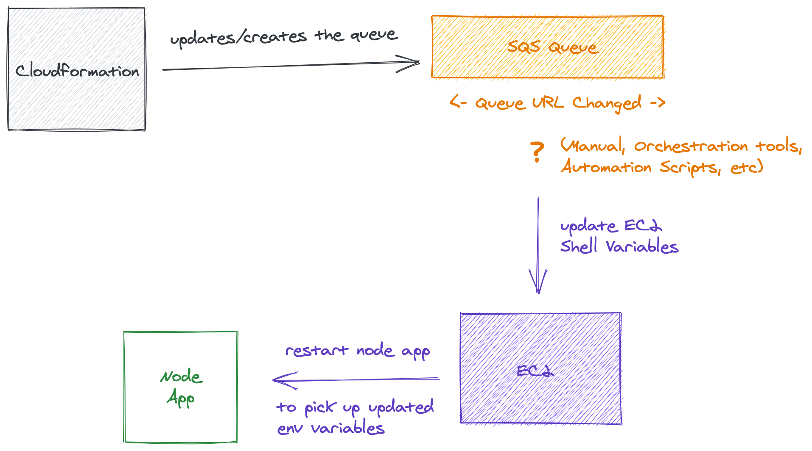

At Gerald, I maintain a fairly medium sized AWS infrastructure but it has a lot of moving parts. We're using around 50 different AWS services.

<NoteBox type="warning" />

> **Note ⓘ** - The following restrictions apply to cross-stack references

- For each AWS account, Export names must be unique within a region.
- You can't create cross-stack references across regions. You can use the intrinsic function Fn::ImportValue to import only values that have been exported within the same region.
- For outputs, the value of the Name property of an Export can't use Ref or GetAtt functions that depend on a resource
- Similarly, the ImportValue function can't include Ref or GetAtt functions that depend on a resource.
- You can't delete a stack if another stack references one of its outputs.
- You can't modify or remove an output value that is referenced by another stack.

So I exported a bunch of resources from every CFN stack and started importing(using) them in other stacks. Soon the
inter-dependencies between different stacks started to grow and would frequently break the CI/CD pipeline which is still okay as
one can argue that there are valid reasons for the restrictions listed above but it's not a very pleasant experience
to face any of the restrictions above.


The Dependency graph between stacks/resource is something that should be well thought out before creating the stack but it is also something that cannot be avoided. One should try to keep it simple.

The major issue that we were facing was not even related to the inter-stack dependencies. But it was something related to how
we were using the resources created by CFN inside our application and servers.

I'll explain it using an example. Let's say we have two Node api servers, one is a BFF (backend for frontend) and another
one is a microservice. Both of them makes use of some AWS resources that are created by a CFN Stack in a separate/independent
process.


Let's also that these servers need to queue items to an **SQS Queue**, need to start a **AWS Batch job** and upload files to an **S3 Bucket**.


What do these servers need in order to do that?

1. AWS Node SDK
2. Queue URL (SQS Queue)
3. Batch Job Definition ARN (AWS Batch)
4. Batch Job Queue ARN (AWS Batch)
5. Bucket Name (S3 Bucket)

These values might not be classified as secrets like AWS Id, AWS Secret, Database Url are but that doesn't mean we can hard code
these values in the codebase. They still need to accessed dynamically from the right context(not from a dev's local machine). There are multiple ways for example making these values available in the shell environment either as a config file or environment variables.


```js
// in node
function getSecretFromShellEnvironment(key) {
  const value = process.env[key];
  return value;
}

function loadSecrets() {
  const secrets = [
    getSecretFromSSM("/prod/bff_api/my_s3_bucket"),
    getSecretFromSSM("/prod/bff_api/stats_batch_job_def"),
    getSecretFromSSM("/prod/bff_api/stats_batch_job_queue"),
    getSecretFromSSM("/prod/bff_api/stats_sqs_queue_url"),
  ];
  return secrets;
}
```

We use SSM Parameters to store all such configuration values and the servers calls the SSM parameter to get all
the required value before started listening. The code looks something like this. The code below is a simplified version of what we actually use. I've removed things like error handling, additional logic, etc.


```js
async function getSecretFromSSM(key) {
  const value = await awsSdk.SSM.getParameter(key);
  return value;
}

async function loadSecrets() {
  const secrets = await Promise.all([
    getSecretFromSSM("/prod/bff_api/my_s3_bucket"),
    getSecretFromSSM("/prod/bff_api/stats_batch_job_def"),
    getSecretFromSSM("/prod/bff_api/stats_batch_job_queue"),
    getSecretFromSSM("/prod/bff_api/stats_sqs_queue_url"),
  ]);
  return secrets;
}
```

The benefit of storing your cloud secrets in a Parameter Store is that you don't have to store your secrets in the
shell anymore. You don't have to PREPARE your EC2 machines to run your applications. Everything that
an application need, it can get it from the Parameter Store itself.



Using Docker plus SSM Parameter we don't ever have to login to any server to configure it before we run our application on it.
Add to that this is way more secure than storing your database credential in the environment shell.
In this case your secrets lives only in the RAM while your application is running. Add IAM on top of this and it becomes
even more secure.

This was definitely a good starting point but it was far from a robust and scalable solution. A major reason for that is
that it requires manual work not just to set it up but for updating as well. You see, when CFN creates those resources,
someone will go to the SSM Parameter Store Console and create all these key-value pairs. Then we would have to copy
the exact same keys in our application codebase as you saw in the code snippet above.

So everytime CFN creates a new AWS resource that we would need to refer in the application, we would copy the value
(ARN, URL, Name, ID) and create a new key-value pair in the SSM Parameter store. After doing that, we would copy the key and
use it in the codebase. Even worse, sometimes CFN replaces existing resources thereby updatinng its ARN, URL, Name, ID, etc.
while the application code is still refering to the old values stored in SSM Parameter Store.


This quickly become a bottleneck for our fast moving team. Everytime someone would make a change in the CFN templates we would check if we need to update anything in the SSM parameter. If yes, after updating the value we would restart the services using that particular parameter(s).

Why Restart? Because the app loads all the configurations and secrets before starting the application so that while the app is running, it doesn't have to download those configs and secrets again and again. It does that one time while it is starting.
For the new config to be used, we would have to stop the application and restart it again.

```js {8,9,12,19}
import express from "express";

import { loadConfigFromSSMParams, loadSecretsFromSSMParams } from "./bootstrap";

const app = express();
const port = 3000;

const config = await loadConfigFromSSMParams();
const secrets = await loadSecretsFromSSMParams();

app.get("/status", (req, res) => {
  if (config.isLive) {
    return res.send("Live ✅");
  }
  res.send("Not live yet ❌");
});

app.get("/add_to_queue", (req, res) => {
  if (secrets.queue_url) {
    // add item to sqs queue
    return res.send("Uploaded ✅");
  }
  res.send("Uploading Failed ❌");
});

app.listen(port, () => {
  console.log(`Example app listening at http://localhost:${port}`);
});
```

## Solution #1

The first solution that we thought of was not very easy to setup and included a lot of components. Anytime CFN would update or replace a resource, we would listen for that event (CloudWatch + EventBridge) and invoke a lambda function to process those events. The lambda would
essentialy do two things.

First is If an action (resource updated/deleted/created) requires us to update a value in the SSM parameter, Lambda would do that.
Second is that if an existing resource (ec2, ecs) needs to be restarted in order to pick the updates value from the SSM parameter, Lambda would restart that resource.

## Solution #2

The second solution was something that I found out when I was exploring some CFN templates on github. This solution is based on the
fact that SSM Parameter and its key vaue pairs are also an AWS resource so CFN can create/update/delete SSM Parameter Key Value pairs as well.

So when we are creating, updating or deleting resources through CFN, why not we also create, update or delete their corresponding
SSM key value pairs within the same template.

```yaml
Resources:
  MyEmptyBucket:
    Type: AWS::S3::Bucket
    DeletionPolicy: Retain
    UpdateReplacePolicy: Retain
    Properties:
      AccessControl: PublicRead
      BucketName: my_empty_bucket

  MyEmptyBucketSSMParam:
    Type: AWS::SSM::Parameter
    Properties:
      Description: DO NOT UPDATE. Updated from CFN
      # unique ssm param key
      Name: "/my_app/resources/s3/my_empty_bucket_name"
      Type: String
      # value of the key is the name of the bucket
      # since "!Ref S3Bucket" returns the name of that bucket
      Value: !Ref MyEmptyBucket
```

And not just resources you could also provide meta information about the stack in your Parameter Store.

```yaml
Resources:
  MyAppDatabaseStackNameSSMParam:
    Type: AWS::SSM::Parameter
    Properties:
      Description: DO NOT UPDATE. Updated from CFN
      # key
      Name: "/my_app/resources/cfn/my_app_stack_name"
      Type: String
      # value
      Value: !Ref "AWS::StackName"

  MyAppDatabaseStackIdSSMParam:
    Type: AWS::SSM::Parameter
    Properties:
      Description: DO NOT UPDATE. Updated from CFN
      # key
      Name: "/my_app/resources/cfn/my_app_stack_id"
      Type: String
      # value
      Value: !Ref "AWS::StackId"
```

Pretty soon I added SSM Parameter Store entries for all of the resources where it made sense.

```yaml
Resources:
  MainVPC:
    Type: AWS::EC2::VPC
    DeletionPolicy: Retain
    Properties:
      CidrBlock: 10.0.0.0/16
      EnableDnsHostnames: true
      EnableDnsSupport: true
      InstanceTenancy: default

  PublicSubnetOne:
    Type: AWS::EC2::Subnet
    DeletionPolicy: Retain
    Properties:
      VpcId: !Ref MainVPC
      AvailabilityZone:
        Fn::Select:
          - 0
          - Fn::GetAZs: { Ref: "AWS::Region" }
      CidrBlock: 10.0.0.0/18
      MapPublicIpOnLaunch: true

  PublicSubnetTwo:
    Type: AWS::EC2::Subnet
    DeletionPolicy: Retain
    Properties:
      VpcId: !Ref MainVPC
      AvailabilityZone:
        Fn::Select:
          - 1
          - Fn::GetAZs: { Ref: "AWS::Region" }
      CidrBlock: 10.0.64.0/18
      MapPublicIpOnLaunch: true

  Ec2VpcIdSSMParam:
    Type: AWS::SSM::Parameter
    Properties:
      Description: DO NOT UPDATE. Updated from CFN
      # key
      Name: "/app_network/plain/resources/ec2/vpc_id"
      Type: String
      # value
      Value: !Ref MainVPC

  Ec2PublicSubnetOneIdSSMParam:
    Type: AWS::SSM::Parameter
    Properties:
      Description: DO NOT UPDATE. Updated from CFN
      # key
      Name: "/app_network/plain/resources/ec2/public_subnet_1_id"
      Type: String
      # value
      Value: !Ref PublicSubnetOne

  Ec2PublicSubnetTwoIdSSMParam:
    Type: AWS::SSM::Parameter
    Properties:
      Description: DO NOT UPDATE. Updated from CFN
      # key
      Name: "/app_network/plain/resources/ec2/public_subnet_2_id"
      Type: String
      # value
      Value: !Ref PublicSubnetTwo
```

This solved one of the problems (The BIG ?) but we still had to address the other one. Who will restart the applications so they
pick up the latest values from Parameter Store? If we were to solve this exact problem then we would have had to add additonal components to our infrastructure. These components would listen for Param Changes and restart the necessary services whenever required. To avoid going this route we got rid of the problem itself.

You see earlier we would load all the configurations and secrets before starting the application so that while the app is running,
it doesn't have to download those configs and secrets again and again.

If the app is running and any config is updated, the app would not know that so we would have to restart the application so it
gets the latest value from Param Store.

To solve this issue we divided the configs & secrets into two groups. The values of the first group can change frequently and the next
the rest of the values belong to the second group. The values of the first group will be accessed from the Param Store in real time i.e we will only download it when we need to access it.

```js {12,13,16,23}
import express from "express";

import {
  loadConfigFromSSMParams,
  loadSecretsFromSSMParams,
  getSSMParamValue,
} from "./bootstrap";

const app = express();
const port = 3000;

const config = await loadConfigFromSSMParams();
const secrets = await loadSecretsFromSSMParams();

app.get("/status", (req, res) => {
  if (config.isLive) {
    return res.send("Live ✅");
  }
  res.send("Not live yet ❌");
});

app.get("/add_to_queue", async (req, res) => {
  const queueUrl = await getSSMParamValue("my_queue");
  // add item to sqs queue queueUrl
  return res.send("Uploaded ✅");
  res.send("Uploading Failed ❌");
});

app.listen(port, () => {
  console.log(`Example app listening at http://localhost:${port}`);
});
```

Following this approach, we wouldn't have to restart the application if a SSM Param Store value changes since the application will
always call SSM Param Store to get the latest value at that very moment when it needs to use it. Of course you can add some caching mechanism to that but always remember to have a cache invalidation process in place.


I was happy with this new change, the only thing left to figure out was how will application know what is the Param Store key of a particular resource and what are all the Param Store values that are available to them.

This was an easy solution. We already use a shared npm package across different projects so we created a JSON object in it which lists all the resources and they Param Store keys.

```js
// private npm package "@org/shared-package"
export const paramStoreKeys = {
  my_app: {
    vpc: {
      vpc_id: "my_app/vpc/vpc_id",
    },
    ecs: {
      user_api_service_name: "my_app/ecs/user_api_service_name",
    },
    s3: {
      temp_object_bucket: "my_app/s3/temp_object_bucket",
    },
    sqs: {
      temp_item_queue_url: "my_app/sqs/temp_item_queue_url",
    },
  },
};

// some file in a project
import { paramStoreKeys } from "@org/shared-package";

app.get("/add_to_queue", async (req, res) => {
  const queueUrl = await getSSMParamValue(
    paramStoreKeys.sqs.temp_item_queue_url
  );
  // add item to sqs queue queueUrl
  return res.send("Uploaded ✅");
  res.send("Uploading Failed ❌");
});
```

And we specify the same value for keys in the CFN templates.

```yaml
Resources:
  MyQueueUrlSSMParam:
    Type: AWS::SSM::Parameter
    Properties:
      Description: DO NOT UPDATE. Updated from CFN
      # unique ssm param key
      Name: "my_app/sqs/temp_item_queue_url"
      Type: String
      # value of the key is the name of the bucket
      # since "!Ref S3Bucket" returns the name of that bucket
      Value: !Ref MyQueue
```

Whenever we want to add a new resource to our CFN Stack we create an new entry for it in the `paramStoreKeys` and use the same key
in the CFN template. By following this appraoch, it has become so much easier to access all of our AWS resources for various purposes like monitoring, api calls, etc.

## Conclusion

Give an awesome conclusin here

Thanks for reading.
