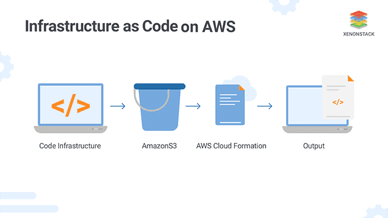

One thing that keeps me excited about technology (everyday work) is to always look out for newer trends, design patterns and innovations. For instance, I've built quite a few react projects in the past and all of them followed a different structure/philosophy right from the start. All the findings (good and bad) that I learn or experience while working on a project helps me look out for better alternatives.

<NoteBox type="primary" />

> One particular change that I absolutely loved was migrating from Redux to MobX. ❤️ Made life so much easier.

This post is about one such lesson that I learned while working with AWS CloudFormation and how adapting to changes quickly helped us keep our sanity.

At Gerald, I maintain a fairly medium sized AWS infrastructure but it has a lot of moving parts. We're using around 50 different AWS services. So while setting up the infrastructure from scratch I knew maintaining all those services from the Console would become a nightmare as you literally have to remember all your infrastructure in your mind.

<NoteBox type="success" />

> **Experience #1** - From past AWS projects I knew that managing AWS from console could become difficult for even a small to medium size account.

I spent some days evaluating between different IaC (Infrastructure as Code) solutions and decided to go with AWS CloudFormation (CFN) for various reasons. Now, one quality in my opinion that you need to learn in order to work with CFN is being patient.
Whether it is writing the CFN template files or while creating the Stack, it takes time.



After days of continously modifying CFN templates, re-deploying then seeing the deployment fails, **I became comfortable with this process** which still helps me to this day. So I deployed my first CFN Stack after about a dozen failed attempts (I probably should have picked up a Hello World template). That was an amazing feeling, you want to make so and so changes in your AWS infrastructure?, just update the template file, re-deploy the Stack and it's done. Cloudformation or IaC in general is an awesome piece of technology.

> **Learning #1** - Get comfortable with seeing lots & lots of configuration when working with CFN.

At this point, I was ready to use my recently acquired CFN knowledge to deploy the AWS infrastructure at our company. So I wrote a template that defines the basic Networking constructs like VPC, Security Groups, NACLs, IAM Roles & Policies, Gateways, VPC Endpoints, and many more. Once that was ready, I added even more resources to the template for our API servers, file storage, workflows etc. I kept on adding more stuff to the same template. Pretty soon I realized that our template was becoming huge in terms of both size and the number of resources that it defined. It got to a point where some CFN APIs started to throw an error because of the exceeding file size.

I was comfortable with seeing lots of configuration in CFN templates but this was different, this was **A LOT**. 3000+ lines of configuration.

> **Learning #2** - Make smaller CFN templates which consists of resources that collectively achieve the same goal. Do not make a single template for the entire solution.

Another thing that I quickly noticed was that, I was constantly switching between our CFN template and AWS Documentation to understand the meanings of some of the configurations. A good solution for that was to add a lot of comments in the CFN templates. The comments could be a line taken from the AWS documentation or it could be my own interpretation of that configuration.

<NoteBox type="warning" />

> Just a quick tip to use `yaml` when writing CFN templates as `JSON` doesn't support comments.

<NoteBox type="primary" />

> **Learning #3** - Add a lot of comments to your CFN templates. They will be helpful to you and to anyone who's new.

I was lucky that we were at a stage where we could shut down some of our aws components to split our templates without majorly effecting our users. So we split one big CFN template into 5 separate templates. I realized the importance of this decision later on when I was setting up our CI/CD pipelines. Since there were a lot of shared resources between these 5 templates, I needed a way to use resources created from one stack in other stacks. That's when I got to know about the cross-stack references feature in CFN using the `Export` and `Import` keywords.

<NoteBox type="warning" />

> **Note ⓘ** - The following restrictions apply to cross-stack references

- For each AWS account, Export names must be unique within a region.
- You can't create cross-stack references across regions. You can use the intrinsic function Fn::ImportValue to import only values that have been exported within the same region.
- For outputs, the value of the Name property of an Export can't use Ref or GetAtt functions that depend on a resource
- Similarly, the ImportValue function can't include Ref or GetAtt functions that depend on a resource.
- You can't delete a stack if another stack references one of its outputs.
- You can't modify or remove an output value that is referenced by another stack.

So I exported a bunch of resources from every CFN stack and started importing(using) them in other stacks. Soon the
inter-dependencies between different stacks started to grow and would frequently break the CI/CD pipeline which is still okay as
one can argue that there are valid reasons for the restrictions listed above but it's not a very pleasant experience
to face any of the restrictions above.


The Dependency graph between stacks/resource is something that should be well thought out before creating the stack but it is also something that cannot be avoided. One should try to keep it simple.

The major issue that we were facing was not even related to the inter-stack dependencies. But it was something related to how
we were using the resources created by CFN inside our application and servers.

I'll explain it using an example. Let's say we have two Node api servers, one is a BFF (backend for frontend) and another
one is a microservice. Both of them makes use of some AWS resources that are created by a CFN Stack in a separate/independent
process. Let's also that these servers need to queue items to an **SQS Queue**, need to start a **AWS Batch job** and upload files to an **S3 Bucket**. What do these servers need in order to do that?

1. AWS Node SDK
2. Queue URL (SQS Queue)
3. Batch Job Definition ARN (AWS Batch)
4. Batch Job Queue ARN (AWS Batch)
5. Bucket Name (S3 Bucket)

These values might not be classified as secrets like AWS Id, AWS Secret, Database Url are but that doesn't mean we can hard code
these values in the codebase. They still need to accessed dynamically from the right context(not from a dev's local machine). There are multiple ways for example making these values available in the shell environment either as a config file or environment variables.

We use SSM Parameters to store all such configuration values and the servers calls the SSM parameter to get all
the required value before started listening. The code looks something like this. The code below is a simplified version of what we actually use. I've removed things like error handling, additional logic, etc.

```js
async function getSecretFromSSM(key) {
  const value = await awsSdk.SSM.getParameter(key);
  return value;
}

async function loadSecrets() {
  const secrets = await Promise.all([
    getSecretFromSSM('/prod/bff_api/my_s3_bucket'),
    getSecretFromSSM('/prod/bff_api/stats_batch_job_def'),
    getSecretFromSSM('/prod/bff_api/stats_batch_job_queue'),
    getSecretFromSSM('/prod/bff_api/stats_sqs_queue_url'),
  ]);
  return secrets;
}
```

The benefit of storing your cloud secrets in a Parameter Store is that you don't have to store your secrets in the
shell anymore. You don't have to PREPARE your EC2 machines or docker containers to run your applications. Everything that
an application need, it can get it from the Parameter Store itself. Using Docker plus SSM Parameter we don't ever have to
login to any server to configure it before we run our application on it. Add to that this is way more secure than storing
your database credential in the environment shell. In this case your secrets lives only in the RAM while your application
is running. Add IAM on top of this and it becomes even more secure.

This was definitely a good starting point but it was far from a robust and scalable solution. A major reason for that is 
that it requires manual work not just to set it up but for updating as well. You see, when CFN creates those resources,
someone will go to the SSM Parameter Store Console and create all these key-value pairs. Then we would have to copy 
the exact same keys in our application codebase as you saw in the code snippet above.

So everytime we CFN creates a new AWS resource that we would need to refer in the application, we would copy the value 
(ARN, URL, Name, ID) and create a new key-value pair in the SSM Parameter store. After doing that, we would copy the key and
use it in the codebase. Even worse, sometimes CFN replaces existing resources thereby updatinng its ARN, URL, Name, ID, etc.
while the application code is still refering to the old values stored in SSM Parameter Store.


-- thought of using ssm parameters

-- how to use ssm parameters in node.js

-- everything can be monitored

-- that's it
