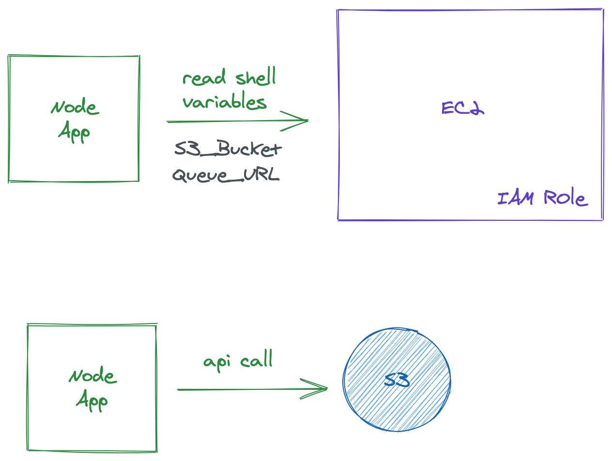

At [Gerald](https://gerald.app), we have a fairly medium-sized AWS infrastructure with workloads that span multiple domains. We're using more than 50 different AWS services. For any change in our AWS account, we use CloudFormation (I'll refer to it as CFN).

One way to share resources between different stacks is using a CFN feature called cross-stack references. It's similar to how `imports`/`exports` work in Javascript but with a few limitations. The following restrictions apply to cross-stack references

- For each AWS account, Export names must be unique within a region.
- You can't create cross-stack references across regions. You can use the intrinsic function Fn::ImportValue to import only values that have been exported within the same region.
- For outputs, the value of the Name property of an Export can't use Ref or GetAtt functions that depend on a resource
- Similarly, the ImportValue function can't include Ref or GetAtt functions that depend on a resource.
- You can't delete a stack if another stack references one of its outputs.
- You can't modify or remove an output value that is referenced by another stack.

We were heavily using this feature across our stacks but very soon the
cross-stack dependencies started to grow which would frequently break the CI/CD pipeline which was still okay as there are valid reasons for the restrictions listed above but it's also not a very pleasant experience to deal with it.


The resource dependencies between stacks is something that should be well planned before creating the stacks but it is also something that cannot be avoided. The major issue that we were facing was not even related to the cross-stack dependencies. But it was something related to how
we were using the resources created by CFN in our applications.

I'll explain it using an example. Let's say we have two Node API servers. Both make use of some AWS resources that are created by a CFN Stack.


Their normal operations include queuing items to an **SQS Queue** and uploading files to an **S3 Bucket**. For these operations (API calls) we were using AWS Node SDK.


What do these servers need in order to do that?

1. Queue URL (SQS Queue)
2. Bucket Name (S3 Bucket)

It would be a terrible idea to hard code these values in the codebase. These values should be provided to our application through a different process often times via a CI/CD pipeline. There are multiple ways for doing that for example making these values available in the EC2 shell environment either as a config file or as environment variables.



The code for accessing those variables from the EC2 shell might look something like this.

```js
// pseudo-code
function getSecretFromShellEnvironment(key) {
  const value = process.env[key];
  return value;
}

function loadSecrets() {
  const secrets = {
    my_s3_bucket: getSecretFromShellEnvironment("/prod/bff_api/my_s3_bucket"),
    queue_url: getSecretFromShellEnvironment("/prod/bff_api/queue_url"),
  };
  return secrets;
}

const secrets = loadSecrets();
```

## SSM Parameter Store

SSM Parameter Store is a cloud key-value store that can be used to store plain text and encrypted string values that can be referenced in applications and scripts using keys assigned to those values. So if I want to store my database `username` and `password` in SSM parameter, I will create a key-value pair for both of them in the SSM Parameter Console. Now, I will be able to access the username and password using their assigned keys in my application.

```shell
KEY - '/my_api/db_username'
VALUE - 'admin'

KEY - '/my_api/db_password'
VALUE - 'password'
```

Here's a picture of its console interface. The **Name** column represents all the Keys in your account and region.


Instead of storing the secrets as environment variables, we use SSM Parameters. The Node app would call the SSM Parameter API to get all the required values before starting the server so it doesn't have to get these values again as long as it doesn't restart. See code below.


```js
async function getSecretFromSSM(key) {
  const value = await awsSdk.SSM.getParameter(key);
  return value;
}

async function loadSecrets() {
  const [my_s3_bucket, queue_url] = await Promise.all([
    getSecretFromSSM("/prod/bff_api/my_s3_bucket"),
    getSecretFromSSM("/prod/bff_api/queue_url"),
  ]);
  return { my_s3_bucket, queue_url };
}

const secrets = await loadSecrets();

server.listen(8000);
```

The benefit of storing your cloud secrets in the Parameter Store is that you don't have to put them in the
EC2 shell anymore. You don't have to **PREPARE your EC2 instances** to run your applications.

> If you need to configure your EC2 instances for running your applications you can also consider using Docker.

This is also more secure than storing your secrets in the environment shell. Add IAM on top of this and it becomes
even more secure.

This was definitely a good starting point but it required manual work not just to initially set it up but for updates as well. Whenever one of our CFN stacks would create a resource, I would go to the SSM Parameter Store console and create its key-value pair. Then I would copy that key in our application codebase.

This process would be repeated every time CFN creates a AWS resources that needed to be accessed in our backend application. Even worse, sometimes CFN would silently replace resources([instead of update](https://docs.aws.amazon.com/AWSCloudFormation/latest/UserGuide/using-cfn-updating-stacks-update-behaviors.html)) thereby changing its ARN, URL, Name, ID, etc while the application code would still be referring to the old values stored in SSM Parameter Store and we wouldn't even know until the application would break.


This quickly became a bottleneck for our fast-paced development team. Every time someone would make a change in the CFN templates we would check if we need to update anything in the SSM Parameter Store. If yes, after updating the value in the store we would also have to restart the Node servers using that value.

Why restarting the servers? We had to restart the servers because we used to load all the values from the store in one go before starting the server so that while the server was running, it didn't have to download those values again. For the server to pick up new values from the store we would have to restart the server.

```js {9,10,14,21,29}
import express from "express";

import { loadConfigFromSSMParams, loadSecretsFromSSMParams } from "./bootstrap";

const app = express();
const port = 3000;

// Load values from SSM Parameter Store
const config = await loadConfigFromSSMParams();
const secrets = await loadSecretsFromSSMParams();

// Register routes
app.get("/status", (req, res) => {
  if (config.isLive) {
    return res.send("Live ✅");
  }
  res.send("Not live yet ❌");
});

app.get("/add_to_queue", (req, res) => {
  if (secrets.queue_url) {
    // add item to sqs queue
    return res.send("Uploaded ✅");
  }
  res.send("Uploading Failed ❌");
});

// Start the server
app.listen(port, () => {
  console.log(`Example app listening at http://localhost:${port}`);
});
```

We had two problems to solve. The first was to automate updating the SSM Parameter Store with newer values and the second was to be able to pick the updated values in the store without any downtime or restarting the servers.

## Solution #1

The first solution that we thought of was not very easy to set up as it included a lot of components. Anytime CFN would update or replace a resource, we would listen for that event (CloudWatch + EventBridge) and invoke a lambda function to process those events. The lambda would essentially do two things.

First If an event (resource updated/deleted/created) requires us to update a value in the Parameter Store, Lambda would do that.
Second is that if an application needs to be restarted in order to pick the updated value from the store, Lambda would restart that application as well.

## Solution #2

The second solution was based on the fact that SSM Parameter and its key-value pairs are also AWS resources so they can be managed by CFN.

So when we are creating, updating, or deleting resources through CFN, why not we also create, update or delete their corresponding
SSM key-value pairs within the same template. See the template below.

```yaml {2,15,19}
Resources:
  MyEmptyBucket:
    Type: AWS::S3::Bucket
    DeletionPolicy: Retain
    UpdateReplacePolicy: Retain
    Properties:
      AccessControl: PublicRead
      BucketName: my_empty_bucket

  MyEmptyBucketSSMParam:
    Type: AWS::SSM::Parameter
    Properties:
      Description: DO NOT UPDATE. Updated from CFN
      # unique ssm param key
      Name: "/my_app/resources/s3/archive_bucket"
      Type: String
      # value of the key is the name of the bucket
      # since "!Ref S3Bucket" returns the name of that bucket
      Value: !Ref MyEmptyBucket
```

So we added SSM Parameter Store entries for all of the resources in all of our CFN Stacks.

```yaml
Resources:
  MainVPC:
    Type: AWS::EC2::VPC
    DeletionPolicy: Retain
    Properties:
      CidrBlock: 10.0.0.0/16
      EnableDnsHostnames: true
      EnableDnsSupport: true
      InstanceTenancy: default

  PublicSubnetOne:
    Type: AWS::EC2::Subnet
    DeletionPolicy: Retain
    Properties:
      VpcId: !Ref MainVPC
      AvailabilityZone:
        Fn::Select:
          - 0
          - Fn::GetAZs: { Ref: "AWS::Region" }
      CidrBlock: 10.0.0.0/18
      MapPublicIpOnLaunch: true

  PublicSubnetTwo:
    Type: AWS::EC2::Subnet
    DeletionPolicy: Retain
    Properties:
      VpcId: !Ref MainVPC
      AvailabilityZone:
        Fn::Select:
          - 1
          - Fn::GetAZs: { Ref: "AWS::Region" }
      CidrBlock: 10.0.64.0/18
      MapPublicIpOnLaunch: true

  Ec2VpcIdSSMParam:
    Type: AWS::SSM::Parameter
    Properties:
      Description: DO NOT UPDATE. Updated from CFN
      # key
      Name: "/app_network/plain/resources/ec2/vpc_id"
      Type: String
      # value
      Value: !Ref MainVPC

  Ec2PublicSubnetOneIdSSMParam:
    Type: AWS::SSM::Parameter
    Properties:
      Description: DO NOT UPDATE. Updated from CFN
      # key
      Name: "/app_network/plain/resources/ec2/public_subnet_1_id"
      Type: String
      # value
      Value: !Ref PublicSubnetOne

  Ec2PublicSubnetTwoIdSSMParam:
    Type: AWS::SSM::Parameter
    Properties:
      Description: DO NOT UPDATE. Updated from CFN
      # key
      Name: "/app_network/plain/resources/ec2/public_subnet_2_id"
      Type: String
      # value
      Value: !Ref PublicSubnetTwo
```

This solved our first problem. I knew that solving the second problem using Lambda would be complicated so we got rid of the problem itself 🤯.

Earlier we would load all the configurations and secrets before starting the application so that while the app is running,
it doesn't have to download those configs and secrets again and again. If the app is running and any config is updated, the app would not know that so we would have to restart the application so it gets the latest value from Param Store.

To solve this issue we divided the configs & secrets into two groups. The values in the first group can change frequently and the values in the second group would rarely change. The values of the first group will be accessed from the Parameter Store in real-time i.e every time it needs to be accessed it is loaded from the Parameter Store via an API call.

```js {13,14,17,25}
import express from "express";

import {
  loadConfigFromSSMParams,
  loadSecretsFromSSMParams,
  getSSMParamValue,
} from "./bootstrap";

const app = express();
const port = 3000;

// loading values that will not change or change rarely
const config = await loadConfigFromSSMParams();
const secrets = await loadSecretsFromSSMParams();

app.get("/status", (req, res) => {
  if (config.isLive) {
    return res.send("Live ✅");
  }
  res.send("Not live yet ❌");
});

app.get("/add_to_queue", async (req, res) => {
  // loading latest value from the store in real time
  const queueUrl = await getSSMParamValue("my_queue");
  // add item to sqs queue queueUrl
  return res.send("Uploaded ✅");
  res.send("Uploading Failed ❌");
});

app.listen(port, () => {
  console.log(`Example app listening at http://localhost:${port}`);
});
```

Following this approach, we didn't have to restart the application when the Store value would change since the application is
always loading the latest value from the Store at that very moment when it needs to access it. Of course, you can add some caching mechanism to that but always remember to have a cache invalidation process in place.


We were quite happy with the results, the only thing left to figure out was that how will different applications know what is the Parameter Store key of a resource that it wants to access.

This was fairly easy as we were already using a shared npm package across multiple projects so we exported a JSON object in that package which lists all the resources and their keys.

```js {8}
// private npm package "@org/shared-package"
export const ssmKeys = {
  my_app: {
    vpc: {
      vpc_id: "my_app/vpc/vpc_id",
    },
    s3: {
      archive_bucket: "my_app/s3/archive_bucket",
    },
    sqs: {
      temp_item_queue_url: "my_app/sqs/temp_item_queue_url",
    },
  },
};
```

Then we can use it in our applications as shown below.

```js {5}
// script.js
import { ssmKeys } from "@org/shared-package";

app.get("/add_to_s3", async (req, res) => {
  const bucket = await getSSMParam(ssmKeys.my_app.s3.archive_bucket);
  // add item to s3
  return res.send("Uploaded ✅");
  res.send("Uploading Failed ❌");
});
```

And we use the same keys when creating these SSM Parameters in the CFN templates.

```yaml {15}
Resources:
  MyEmptyBucket:
    Type: AWS::S3::Bucket
    DeletionPolicy: Retain
    UpdateReplacePolicy: Retain
    Properties:
      AccessControl: PublicRead
      BucketName: my_empty_bucket

  MyEmptyBucketSSMParam:
    Type: AWS::SSM::Parameter
    Properties:
      Description: DO NOT UPDATE. Updated from CFN
      # unique ssm param key
      Name: "my_app/s3/archive_bucket"
      Type: String
      # value of the key is the name of the bucket
      # since "!Ref S3Bucket" returns the name of that bucket
      Value: !Ref MyEmptyBucket
```

Whenever we want to add a new resource to our CFN Stack we create a new entry for it in the `ssmKeys` and use the same key
in the CFN template. By following this approach, it has become so much easier to access all of our AWS resources for various purposes like monitoring, api calls, etc across multiple projects.

Another benefit that we found out later is that you can also use SSM Parameter Store keys to refer to resources across multiple stacks similar to the cross-stack reference feature but without any of its limitations. We've removed all of our stack `exports` and `imports` across all of our CFN stacks and replaced them with referencing resources via SSM Parameter Store.


```yaml {10,11,21}
## Importing resources created in other stacks 
## using their SSM Parameter Keys
Parameters:
  MyEmptyBucket:
    Type: AWS::SSM::Parameter::Value<AWS::EC2::Image::Id>
    Default: my_app/s3/archive_bucket
    Description: The archive bucket created by the storage stack
  MainVPC:
    Description: VpcId of the Network Stack
    Type: "AWS::SSM::Parameter::Value<String>"
    Default: "/app_network/plain/resources/ec2/vpc_id"
  PublicSubnetOne:
    Description: Public Subnet One of the Network Stack
    Type: "AWS::SSM::Parameter::Value<String>"
    Default: "/app_network/plain/resources/ec2/public_subnet_1_id"

Resources:
  MyEC2SecurityGroup:
    Type: AWS::EC2::SecurityGroup
    Properties:
      VpcId: !Ref MainVPC
```

And BTW did I tell you that SSM Parameter Store is [free](https://aws.amazon.com/systems-manager/pricing/) for all the above use cases 🙅🏻

## Conclusion

SSM Parameter Store is one of my favourites AWS service that can be used in so many different ways to solve a lot of problems. I highly recommend trying it out. You can also reach out to me at my [twitter](https://twitter.com/tusharf5) if you have any questions related to this.

Thanks for reading.
