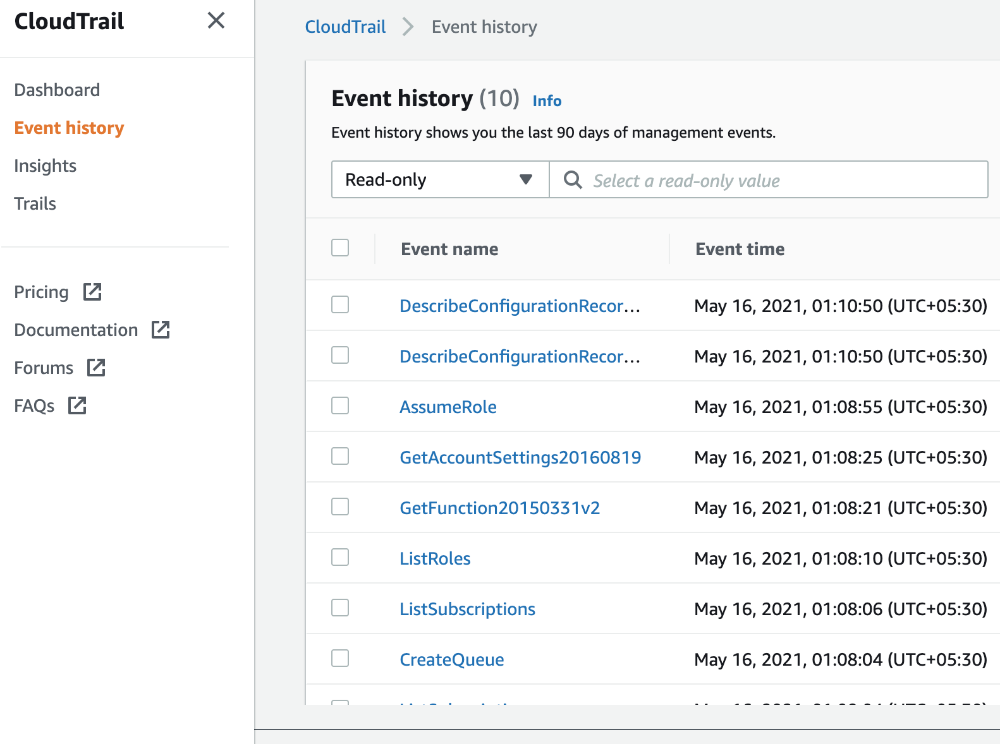
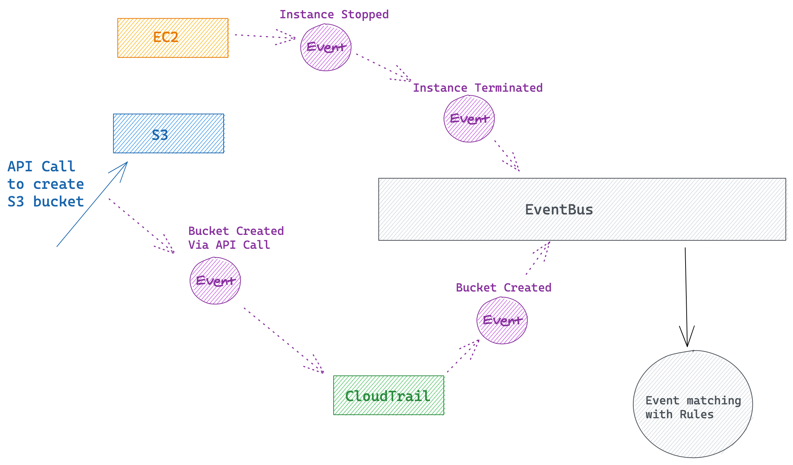
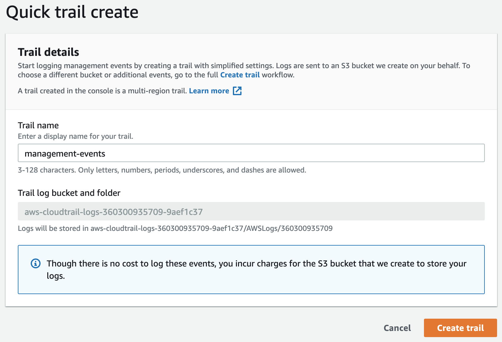
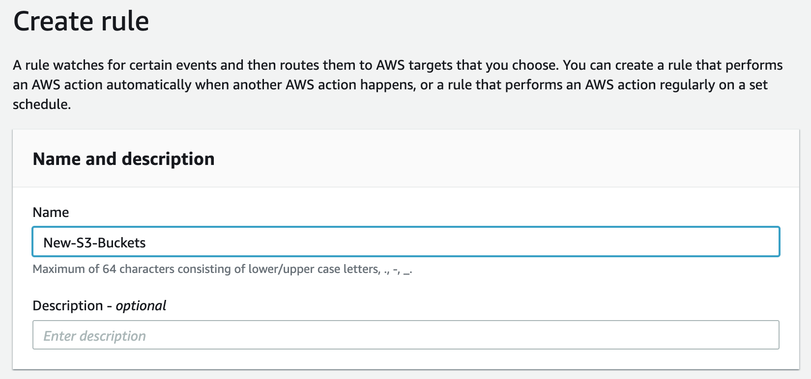
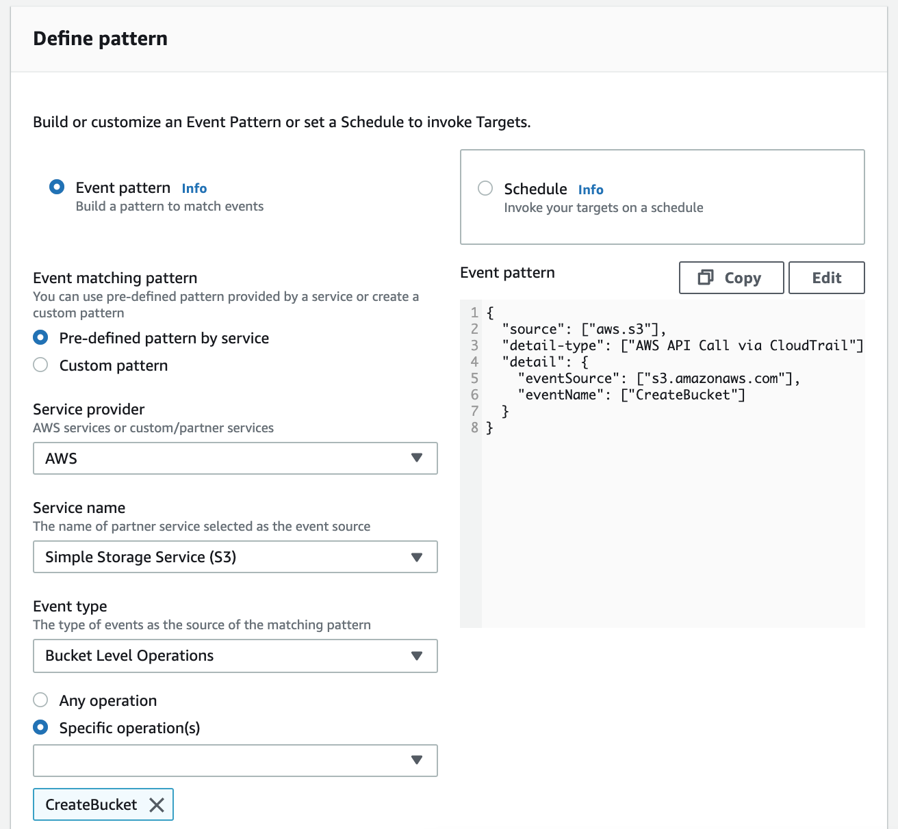
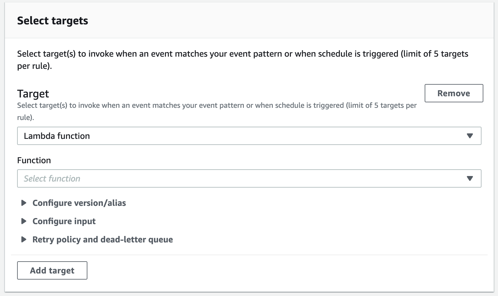

An AWS account captures a lot of events. Like when someone logs in, creates a VPC, sees the list of EC2 instances, deletes an s3 bucket, etc. The list of events
is endless which is not surprising when you consider the number of services it has.

Even in a new account, you can see the list of a lot of these events by going to the AWS **CloudTrail's** dashboard and then clicking on the Event History tab as seen in the image below.



Before we look at how to listen to these events we first need to understand what events are and how they are created.

There are three types of events available to us via **CloudTrail**.

1. [Management Events](https://docs.aws.amazon.com/awscloudtrail/latest/userguide/logging-management-events-with-cloudtrail.html)
2. [Data Events](https://docs.aws.amazon.com/awscloudtrail/latest/userguide/logging-data-events-with-cloudtrail.html)
3. [Insights Events](https://docs.aws.amazon.com/awscloudtrail/latest/userguide/logging-insights-events-with-cloudtrail.html)

> Management events provide visibility into management operations that are performed on resources in your AWS account. These are also known as control plane operations. - _From the AWS Docs_

In other words, anytime a configuration change or activity is captured in an AWS account it's most likely to be a Management Event.

> Data events provide visibility into the resource operations performed on or within a resource. These are also known as data plane operations. Data events are often high-volume activities. - _From the AWS Docs_

You can think of Data Events as events that capture data-centric operations like uploading something to an S3 bucket, payload for lambda invocations, DynamoDB calls that modifies data.

For our use case, we wanted to be notified whenever one of our **SQS-Lambda** Integration was disabled. This is a configuration change which means that the event for that would be a management event.

CloudTrail is not the only service that deals with events in an AWS account. There is another service called **EventBridge** (used to be called CloudWatch Events).

I won't go into details of how EventBridge works but at a high level, it has a component which is called an **EventBus** which is similar to a conveyor belt in a factory. When you create a new AWS account, it comes with a pre-installed conveyor belt i.e a default EventBus. Now a lot of AWS services send events to EventBridge via the default EventBus. You can take a look at the full list [here](https://docs.aws.amazon.com/eventbridge/latest/userguide/eb-service-event.html).

So now we know that CloudTrail records three types of events and EventBridge also receives events from some AWS services. Note that an event may be recorded by both the services. For example, when you shut down an EC2 instance, that event is recorded by CloudTrail, and EC2 service also sends that event natively to EventBridge.

CloudTrail supports much more events than the events that are sent by AWS services to EventBridge.

**But how does CloudTrail supports so many events?**

One reason is that it is older than EventBridge and the second is that because CloudTrail records API calls to our account whether they are being made by us or by AWS itself. That's how it can record a lot of events because most of the events are a result of an API call being made to our AWS account.

One interesting thing about these two services is that you can also set up CloudTrail to send all events that it captures to EventBridge. All the events in EventBridge that are sent by CloudTrail have the value of the field `detail-type` set to `AWS API Call via CloudTrail`.

Here's a diagram to illustrate the event flow in EventBridge.



**So how do we set up CloudTrail to send events to EventBridge?**

For that we need to create something called a Trail in the CloudTrail's dashboard or via CLI.

_This was the thing that I spent the most time struggling with. I thought just because CloudTrail is showing an event in the Event History tab, it means it will also send that event to EventBridge. But that is not true, for most of the events you need to set up a Trail first before CloudTrail will send that event to EventBridge._

As the name suggests a Trail is a series of events that are recorded by CloudTrail and saved on an S3 bucket. You can view the S3 bucket to see the list of all the past events that were recorded by CloudTrail.

My suggestion is that if you are only interested in listening to a bunch of events and do not really care if those events are being saved to S3 by the Trail then you can configure the S3 bucket to use the cheapest storage type so your s3 storage cost gets reduced.

A Trail can be set up for storing management events, data events or insights events. Management events are the cheapest to record. Check the pricing [here](https://aws.amazon.com/cloudtrail/pricing/).



For our use case, we were only interested in management events so we created a Trail that only stored that.

So now we know a little about events let's see how can we listen to these events. We do that by adding a **Rule** to EventBridge. For example, we can add a rule to send a notification to us (via a Lambda Function or SNS topic) whenever someone creates a new EC2 instance or when someone creates an S3 bucket.

The first thing to do when you are interested in listening to an event in an AWS account is figuring out whether that event
is being sent to EventBridge natively by the service or not. You can check that [here](https://docs.aws.amazon.com/eventbridge/latest/userguide/eb-service-event.html).

If yes, then you can skip setting up CloudTrail and directly configure EventBridge to start listening to that event.

If not, then first you have to check [here](https://docs.aws.amazon.com/awscloudtrail/latest/userguide/cloudtrail-aws-service-specific-topics.html#cloudtrail-aws-service-specific-topics-list) that whether CloudTrail records that event or not. There are very high chances that CloudTrail will have support to capture the event you are interested in.

Now let's take an example. Let's say we want to execute a lambda function whenever someone stops or terminates any EC2 instance in our AWS account. Let's open the EventBridge console and click on **Create Rule**.

You provide a name, the event pattern, and the action(target) to take. There are some other minor configurations but these 3 are the important ones.



EventBridge supports the following targets as actions when a rule is matched. Take a look that the updated list [here](https://docs.aws.amazon.com/eventbridge/latest/userguide/eb-targets.html).

- API destination
- API Gateway
- AWS Batch job queue
- CloudWatch Logs group
- CodeBuild project
- CodePipeline
- Amazon EC2 CreateSnapshot API call
- Amazon EC2 RebootInstances API call
- Amazon EC2 StopInstances API call
- Amazon EC2 TerminateInstances API call
- Amazon ECS tasks
- Event bus in a different account or Region
- Firehose delivery stream (Kinesis Data Firehose)
- Inspector assessment template (Amazon Inspector)
- Kinesis stream (Kinesis Data Streams)
- AWS Lambda function
- Amazon Redshift clusters (Data API statement execution)
- SageMaker Pipeline
- Amazon SNS topic
- Amazon SQS queues (includes FIFO queues)
- SSM Automation
- SSM OpsItem
- SSM Run Command

Step Functions state machines

The console provides a GUI to create your event pattern using some pre-defined options which or you can provide a JSON pattern for the event. See how to create event patterns [here](https://docs.aws.amazon.com/eventbridge/latest/userguide/eb-event-patterns.html).



For the EC2 event, our event pattern would look like this. This event is being sent to EventBridge by the EC2 service itself so we don't have to set up a CloudTrail for this event. It would work out of the box.

```json
{
  "source": ["aws.ec2"],
  "detail-type": ["EC2 Instance State-change Notification"],
  "detail": {
    "state": ["stopped", "terminated"]
  }
}
```

Now as soon as someone tries to stop or terminate the instance, The AWS EC2 service will send that event to the default EventBus in EventBridge, EventBridge will match it against all of our rules and if matched and it will invoke our lambda function with the details about the event.



Now let's take another example where the service does not natively send an event to EventBridge which means we need to listen to that event using CloudTrail. **After setting up a Trail**, we create a rule to listen to anytime someone creates an S3 bucket.

This is how the event pattern would look like.

```json 2
{
  "source": ["aws.s3"],
  "detail-type": ["AWS API Call via CloudTrail"],
  "detail": {
    "eventSource": ["s3.amazonaws.com"],
    "eventName": ["CreateBucket"]
  }
}
```

If you're curious to know what the event pattern for our use case was. Here's it.

```json 2
{
  "source": ["aws.lambda"],
  "detail-type": ["AWS API Call via CloudTrail"],
  "detail": {
    "eventSource": ["lambda.amazonaws.com"],
    "eventName": [{ "prefix": "UpdateEventSourceMapping" }]
  }
}
```

Did you notice the _AWS API Call via CloudTrail_? This tells that this event is being provided by CloudTrail.

The great thing about the above setup is that it is completely serverless so we only pay for what we use. There are other ways to listen to events in an AWS account but this seems to be my new go-to way of doing it.

Thank you for reading.
