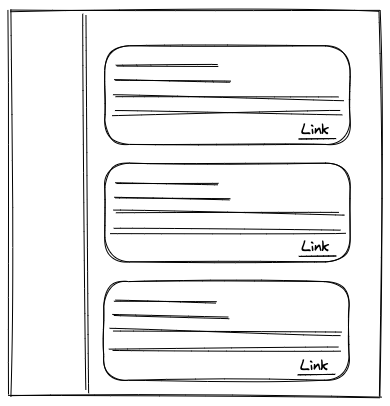
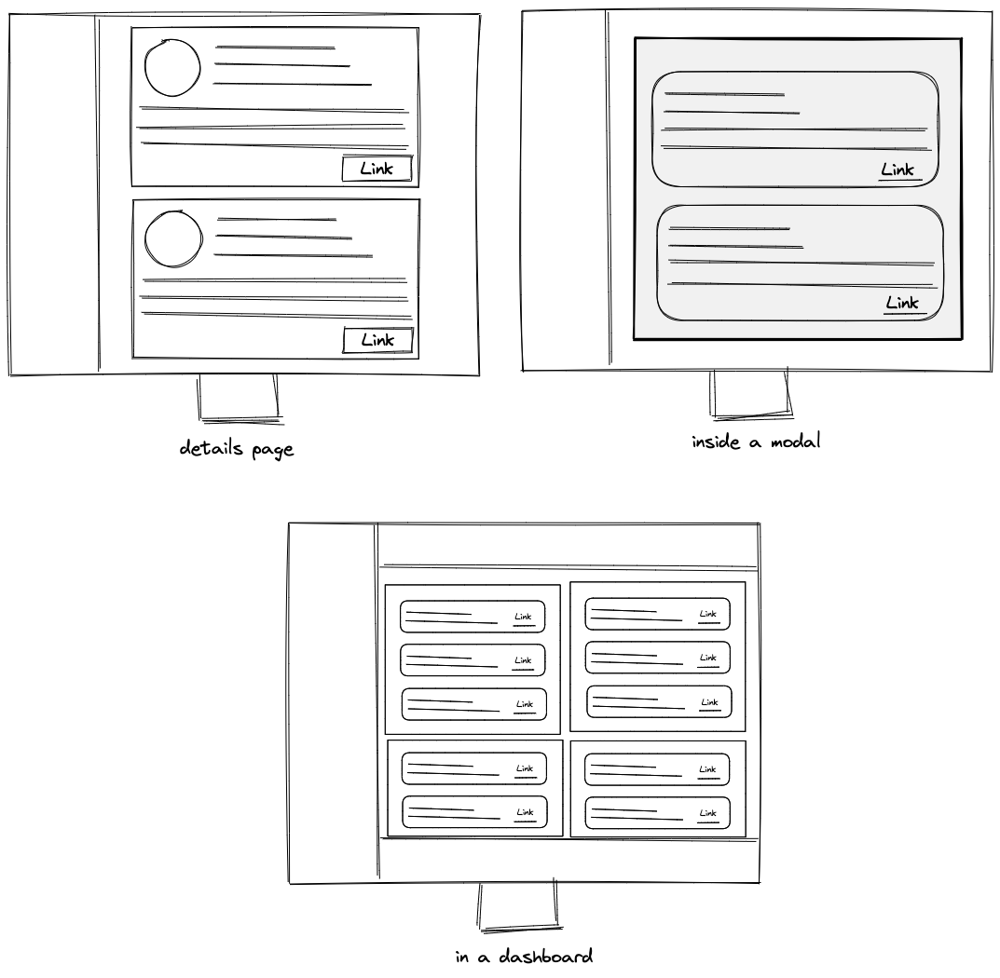

Let's say we have a card component as shown in the below image.


When we want to use it for a large screen size, it looks exactly the same. The CSS also remains the same.

```css
.cardComponent {
  /* Style attributes */
}
```


When we want to use it for a smaller screen size, we change the layout of it a little. We have to write additional
CSS for this change in the layout. The way we target this screen size in the css is by using media queries.

```css
.cardComponent {
  /* Style attributes */
}

/* Apply these styles when window size is less than 756px */
@media screen and (max-width: 756px) {
  .cardComponent {
    /* Overwriting Style attributes */
  }
}
```



Media queries are very commonly used for responsive design. So what's the fuss about **Container Queries?**. Let's try to understand the problem that container queries will help us solve.

A limitation of using media queries is that the width and height in media queries are based on the window size.

In other words whatever additional css you've written to make your UI responsive that css will only be triggered
when the size of the window changes.

But do we only want the responsivenss when the size of the window changes? If we take the above example, in order to
change the layout of the following card component, the screen size needs to change from 1080px to 756px.


This was our only shot at making something responsive by targetting different screen sizes. But if we think about it,
there are use cases when the screen size does not change but we still need to change the layout of a component depending on
where it is placed.

To better understand that use case let's keep the screen size constant and see the below layout.



You see that even though the screen size remain the same but depending on where our card component is placed we need to
change its layout/structure/stylings. We can't use media queries for this. Media queries only work when the screen size changes.

What if we had a way to write media queries that would target our component's container's width instead of the windows width. Something like if my component is used in a container of size 400px then add this css, if is is being used in a container of size 600px then add this css.

That's where the container queries would help us.

So let's say we get a requirement from the design team that we have to create an accordian. If it is being used in a modal
then it needs to look differently than when it is rendered on the main layout. It also needs to look differen

The way we can achieve this by using container queries. We would write the base styles for our accordian and then specify that
if the conatiner size is 300 px (inside a dropdown) then apply a serate block of css, if the container size is 600px (inside a modal) then apply another block of css.
