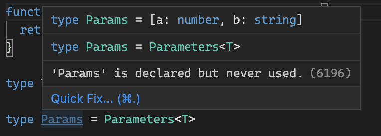

“Everything fails, all the time” - Werner Vogels, Amazon CTO

I love this quote by Vogels because it’s so true. It’s really a nice thought to have in your mind while building any program. Expecting your program to always follow the [“happy path”](https://en.wikipedia.org/wiki/Happy_path) is really naive.

I am writing this blog while I am working on an integration where we have to make a lot of API calls to fetch data from an external service. The first implementation was a quick one just to check if the APIs work correctly, response time, any errors, rate limiting, etc.

If you are not interested in the backstory, you can go straight to the part that talks about the retry function implementation [here](#the-implementation).

The function took about 14 minutes to complete and made around 16k API calls. That’s a lot of calls for a single function. I modified the code to make use of concurrent API calls using `Promise.all` which brought down the time to 7 minutes.

One thing that I noticed was that after making around 10k calls, the API randomly returns a timeout error. This was annoying because one error would cause all of the previous successful 10k calls to be of no use.

One thing to consider before solving these types of issues is to know how critical it is for all the calls to be successful. For example, for a finance app, we must not ignore any error and we must put in all the measures for it to either retry, self-heal or at least log and report the error for human intervention. But for an app that fetches weather reports for all the major cities in the world, while it would be good to at least have some retry/logging mechanism in place, it would not be a big deal if we are not able to retrieve weather data for one of the cities.

Our use case was not mission-critical so we could just ignore the failed API call promise. Here’s an easy way to do it, especially when you are using `Promise.all` where one rejected promise will cancel all of the in-progress ones.

```tsx
await Promise.all([functionThatReturnsAPromise().catch((e) => undefined)]);
```

What this does is, it adds an error handler to the promise returned by `functionThatReturnsAPromise` and the error handler catches the error and returns a resolved value.

This helped us get rid of one major issue, one API call failure wouldn’t fail the entire program. We ignore it silently but we do log the error for debugging purposes. We also added metric reporting so if more than **10%** of the calls failed, we send a metric to CloudWatch which triggers an alarm so we know we need to look at the logs as this behavior is not usual.

It seems like we checked all the boxes to make this function more robust. There is error reporting, it knows how to handle and ignore errors, logs, and alarms.

But there was one more thing that I wanted to do before calling it a day. You see someone great once said

> Defeat happens only to those who refuse to try again.

I live by this quote, so it naturally comes to my coding style as well. Things fail, but that doesn’t mean we shouldn’t retry. I figured we could retry a failed API call a few times before actually giving up and **voilà!** adding a retry mechanism resulted in all calls being able to successfully fetch the data, some had to retry 1 or 2 times but eventually succeeded.

## The Implementation

Let’s talk about the actual retry function implementation. We use Typescript for everything. I am a big Typescript advocate. It’s much more than an autocompletion plugin but this meme is still great.


This was not the first time we were making an API call that could use a retry mechanism. After all, most of the backend services are a bunch of API calls with some data transformation. So I wanted to write a utility function that can automatically retry any function on failure. I’ve written about such an implementation in JS. You can check that [here](https://tusharsharma.dev/posts/retry-design-pattern-with-js-promises).

Typescript is awesome but what good is a typescript code that doesn’t give you full type safety.


This is the implementation of the function.

```tsx
/**
 * Retries a function n number of times before giving up
 */
export async function retry<T extends (...arg0: any[]) => any>(
  fn: T,
  args: Parameters<T>,
  maxTry: number,
  retryCount = 1
): Promise<ReturnType<T>> {
  const currRetry = typeof retryCount === "number" ? retryCount : 1;
  try {
    const result = await fn(...args);
    return result;
  } catch (e) {
    console.log(`Retry ${currRetry} failed.`);
    if (currRetry > maxTry) {
      console.log(`All ${maxTry} retry attempts exhausted`);
      throw e;
    }
    return retry(fn, args, maxTry, currRetry + 1);
  }
}
```

This is how one would use this function.

```tsx
/*
 * Function to retry
 */
async function callAPI(
  arg1: string,
  arg2: number,
  arg3: { id: string }
): Promise<{ data: Array<string> }> {
  return { data: ["array", "of", "strings"] };
}

// This will call the above function at most 5 times if it fails continuously.
const result = await retry(callAPI, ["hello", 2, { id: "world" }], 5);
```

The nice thing is that it preserves all the types (parameter and return type) of the function being called which means that it gives you autocompletion and complains if you are not passing in the right parameters.

The parameters are typed.


The return type is also of the called function.


The implementation is fairly straightforward, what’s interesting is using the usage of some utility types from Typescript which is where all the magic happens. Let’s take a closer look at it.

```tsx
export async function retry<T extends (...arg0: any[]) => any>(
  fn: T,
  args: Parameters<T>,
  maxTry: number,
  retryCount = 1
): Promise<ReturnType<T>>;
```

```tsx
function retry<T extends (...arg0: any[]) => any>();
```

This is where we are declaring a type constrained generic variable called **“T”** which can only be a function that’s why the `T extends (...arg0: any[]) => any` .

```tsx
(fn: T, args: Parameters<T>)
```

Two things to note here, first, we are assigning our generic variable to the first parameter of the function. In plain English this is like saying to Typescript “Hey, there’s going be this variable T which can only be a function and you can assign it to the first parameter of the function”. This basically means whatever is the type of the first parameter will be assigned to the variable T.

This is similar to something like below where typescript is extracting the type of the function and assigning it to the type T. Remember `typeof` is also a typescript construct and is different from Javascript when it is purely used to define the type. It is like a type extractor in Typescript.

```tsx
function hello() {
  return "world";
}

type T = typeof hello;
```


Alright, back to our function.

```tsx
(fn: T, args: Parameters<T>)
```

So, Typescript will be aware of the type of our `fn` parameter stored in the `type` variable **T**. The second parameter is `args: Parameters<T>` where we are using a TS utility type called `Parameters<T>` What this does is it extracts the parameters type of a function. Read more about it [here](https://www.typescriptlang.org/docs/handbook/utility-types.html#parameterstype).

Now since we’ve assigned our T type variable to the first parameter (which is a function), `args: Parameters<T>` basically means whatever the `Parameters` type of the first parameter is, assign that type to this second parameter.

The below example would make it more clear.

```tsx
function hello(a: number, b: string): string {
  return "world";
}

type T = typeof hello;

type Params = Parameters<T>;
```



In a similar way, we define the return type of our retry function.

```tsx
Promise<ReturnType<T>>
```

Let’s focus on the `ReturnType<T>` , This is again one of the utility types provided by Typescript. Read about it [here](https://www.typescriptlang.org/docs/handbook/utility-types.html#returntypetype).

Similar to the `Parameters` utility type, the `ReturnType` extracts the return type from a function type.

```tsx
function hello(a: number, b: string): string {
  return "world";
}

type T = typeof hello;

type Params = Parameters<T>;

type Return = ReturnType<T>;
```


Now since we’ve assigned our T type variable to the first parameter (which is a function), `ReturnType<T>` basically means whatever the `ReturnType` type of the first parameter is, assign that type to the return type of this function.

I am an advocate for using Typescript for any javascript project but I also believe that just using it won’t solve `any` (no pun intended) problem. You can totally write Typescript code in a way that it's not helping you and your team at all. One way is to use `any` everywhere. But that’s like using a samurai sword to spread jam on your bread. It’s not how it’s meant to be used.

Use Typescript everywhere and use it wisely.

Thanks for reading.
